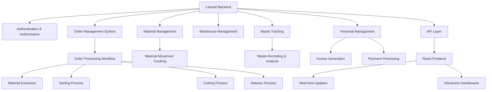

# Laravel Advanced Order Processing System - Recreation Guide

## Overview
This comprehensive guide contains AI prompts/commands to recreate a complete Laravel advanced order processing system with weight tracking, waste management, and complex business logic workflows.

## System Architecture



## 1. Project Setup and Installation

### Prompt 1.1: Create Laravel Project Structure
```
Create a new Laravel project with the following structure:

```
composer create-project laravel/laravel advanced-order-processing-system --prefer-dist
cd advanced-order-processing-system

# Install additional dependencies
composer require doctrine/dbal
composer require laravel/sanctum

# Install frontend dependencies
npm install
npm install react react-dom @vitejs/plugin-react --save-dev
npm install axios chart.js react-chartjs-2
npm install tailwindcss postcss autoprefixer
npx tailwindcss init -p

# Generate application key
php artisan key:generate
```

### Prompt 1.2: Configure Environment
```
Configure the Laravel environment file (.env) with the following settings:

```
DB_CONNECTION=mysql
DB_HOST=127.0.0.1
DB_PORT=3306
DB_DATABASE=advanced_order_processing
DB_USERNAME=your_username
DB_PASSWORD=your_password

# API Configuration
SANCTUM_STATEFUL_DOMAINS=localhost:3000,127.0.0.1:3000
FRONTEND_URL=http://localhost:3000

# Application Settings
APP_NAME="Advanced Order Processing System"
APP_ENV=local
APP_KEY=base64:YOUR_GENERATED_KEY_HERE
APP_DEBUG=true
APP_URL=http://localhost:8000

# Mail Configuration (for notifications)
MAIL_MAILER=smtp
MAIL_HOST=mailpit
MAIL_PORT=1025
MAIL_USERNAME=null
MAIL_PASSWORD=null
MAIL_ENCRYPTION=null
MAIL_FROM_ADDRESS="hello@example.com"
MAIL_FROM_NAME="${APP_NAME}"
```

## 2. Database Schema and Migrations

### Prompt 2.1: Create Database Migrations
```
Create the following database migrations for the advanced order processing system:
```

### Migration 2.1.1: Create Warehouses Table
```php
<?php

use Illuminate\Database\Migrations\Migration;
use Illuminate\Database\Schema\Blueprint;
use Illuminate\Support\Facades\Schema;

return new class extends Migration
{
    public function up()
    {
        Schema::create('warehouses', function (Blueprint $table) {
            $table->id();
            $table->string('name', 200);
            $table->text('description')->nullable();
            $table->enum('type', ['مستودع_رئيسي', 'مستودع_فرز', 'مستودع_قص', 'مستودع_نهائي'])->default('مستودع_رئيسي');
            $table->decimal('capacity', 10, 2);
            $table->decimal('current_utilization', 10, 2)->default(0);
            $table->string('location', 200)->nullable();
            $table->boolean('is_active')->default(true);
            $table->foreignId('manager_id')->nullable()->constrained('users')->onDelete('set null');
            $table->timestamps();

            $table->index(['type', 'is_active']);
            $table->index('manager_id');
        });
    }

    public function down()
    {
        Schema::dropIfExists('warehouses');
    }
};
```

### Migration 2.1.2: Create Materials Table
```php
<?php

use Illuminate\Database\Migrations\Migration;
use Illuminate\Database\Schema\Blueprint;
use Illuminate\Support\Facades\Schema;

return new class extends Migration
{
    public function up()
    {
        Schema::create('materials', function (Blueprint $table) {
            $table->id();
            $table->string('name', 200);
            $table->string('description', 100)->nullable();
            $table->enum('type', ['كرتون', 'ورق', 'بلاستيك', 'معدن', 'خشب', 'زجاج', 'آخر'])->default('ورق');
            $table->enum('shape', ['رول', 'دغما', 'بالة'])->default('رول');
            $table->decimal('weight', 10, 2);
            $table->decimal('length', 8, 2)->nullable();
            $table->decimal('width', 8, 2)->nullable();
            $table->decimal('grammage', 8, 2)->nullable();
            $table->string('invoice_number', 50)->nullable();
            $table->enum('quality', ['ممتاز', 'جيد', 'متوسط', 'مقبول'])->nullable();
            $table->string('roll_number', 50)->nullable();
            $table->string('source', 100)->nullable();
            $table->decimal('cost_per_ton', 10, 2)->nullable();
            $table->foreignId('warehouse_id')->constrained('warehouses')->onDelete('cascade');
            $table->enum('status', ['متاح', 'محجوز', 'خارج_المخزون'])->default('متاح');
            $table->decimal('available_weight', 10, 2)->default(0);
            $table->decimal('reserved_weight', 10, 2)->default(0);
            $table->string('image')->nullable();
            $table->text('notes')->nullable();
            $table->timestamp('expiry_date')->nullable();
            $table->timestamps();

            $table->index(['warehouse_id', 'status']);
            $table->index(['type', 'shape']);
            $table->index('invoice_number');
            $table->index('roll_number');
        });
    }

    public function down()
    {
        Schema::dropIfExists('materials');
    }
};
```

### Migration 2.1.3: Create Customers Table
```php
<?php

use Illuminate\Database\Migrations\Migration;
use Illuminate\Database\Schema\Blueprint;
use Illuminate\Support\Facades\Schema;

return new class extends Migration
{
    public function up()
    {
        Schema::create('customers', function (Blueprint $table) {
            $table->id();
            $table->string('name', 200);
            $table->string('phone', 50)->nullable();
            $table->string('email', 100)->nullable();
            $table->text('address')->nullable();
            $table->string('commercial_register', 50)->nullable();
            $table->string('tax_number', 50)->nullable();
            $table->decimal('credit_limit', 12, 2)->default(0);
            $table->enum('payment_terms', ['نقدي', 'آجل_15', 'آجل_30', 'آجل_60'])->default('نقدي');
            $table->enum('customer_type', ['فردي', 'شركة', 'مؤسسة'])->default('فردي');
            $table->boolean('is_active')->default(true);
            $table->text('notes')->nullable();
            $table->foreignId('sales_rep_id')->nullable()->constrained('users')->onDelete('set null');
            $table->timestamps();

            $table->index('email');
            $table->index('phone');
            $table->index('commercial_register');
            $table->index('is_active');
        });
    }

    public function down()
    {
        Schema::dropIfExists('customers');
    }
};
```

### Migration 2.1.4: Create Orders Table
```php
<?php

use Illuminate\Database\Migrations\Migration;
use Illuminate\Database\Schema\Blueprint;
use Illuminate\Support\Facades\Schema;

return new class extends Migration
{
    public function up()
    {
        Schema::create('orders', function (Blueprint $table) {
            $table->id();
            $table->string('order_number', 50)->unique();
            $table->foreignId('customer_id')->constrained('customers')->onDelete('cascade');
            $table->foreignId('created_by')->constrained('users')->onDelete('cascade');
            $table->foreignId('assigned_to')->nullable()->constrained('users')->onDelete('set null');

            $table->enum('status', ['مسودة', 'قيد_المراجعة', 'مؤكد', 'قيد_التنفيذ', 'مكتمل', 'ملغي'])->default('مسودة');
            $table->enum('current_stage', ['إنشاء', 'مراجعة', 'حجز_المواد', 'فرز', 'قص', 'تعبئة', 'فوترة', 'تسليم'])->default('إنشاء');
            $table->text('description')->nullable();

            $table->decimal('required_weight', 10, 2)->nullable();
            $table->decimal('required_length', 8, 2)->nullable();
            $table->decimal('required_width', 8, 2)->nullable();
            $table->integer('required_plates')->nullable();
            $table->enum('material_type', ['كرتون', 'ورق', 'بلاستيك', 'معدن', 'خشب', 'زجاج', 'آخر'])->nullable();

            $table->enum('delivery_method', ['استلام_ذاتي', 'توصيل', 'شحن'])->default('استلام_ذاتي');
            $table->text('delivery_address')->nullable();
            $table->date('required_delivery_date')->nullable();
            $table->date('actual_delivery_date')->nullable();

            $table->decimal('estimated_price', 12, 2)->default(0);
            $table->decimal('final_price', 12, 2)->default(0);
            $table->decimal('paid_amount', 12, 2)->default(0);
            $table->decimal('remaining_amount', 12, 2)->default(0);
            $table->decimal('discount', 12, 2)->default(0);

            $table->timestamp('submitted_at')->nullable();
            $table->timestamp('approved_at')->nullable();
            $table->timestamp('started_at')->nullable();
            $table->timestamp('completed_at')->nullable();

            $table->text('notes')->nullable();
            $table->json('specifications')->nullable();
            $table->boolean('is_urgent')->default(false);

            $table->timestamps();

            $table->index('order_number');
            $table->index(['customer_id', 'status']);
            $table->index(['status', 'current_stage']);
            $table->index('created_at');
            $table->index('required_delivery_date');
        });
    }

    public function down()
    {
        Schema::dropIfExists('orders');
    }
};
```

### Migration 2.1.5: Create Order Materials Table
```php
<?php

use Illuminate\Database\Migrations\Migration;
use Illuminate\Database\Schema\Blueprint;
use Illuminate\Support\Facades\Schema;

return new class extends Migration
{
    public function up()
    {
        Schema::create('order_materials', function (Blueprint $table) {
            $table->id();

            $table->foreignId('order_id')->constrained('orders')->onDelete('cascade');
            $table->foreignId('material_id')->constrained('materials')->onDelete('cascade');

            $table->decimal('requested_weight', 10, 2);
            $table->decimal('requested_length', 8, 2)->nullable();
            $table->decimal('requested_width', 8, 2)->nullable();
            $table->integer('requested_plates')->nullable();

            $table->decimal('extracted_weight', 10, 2)->default(0);
            $table->decimal('sorted_weight', 10, 2)->default(0);
            $table->decimal('cut_weight', 10, 2)->default(0);
            $table->decimal('delivered_weight', 10, 2)->default(0);
            $table->decimal('returned_weight', 10, 2)->default(0);

            $table->decimal('sorting_waste_weight', 10, 2)->default(0);
            $table->decimal('sorting_waste_percentage', 5, 2)->default(0);
            $table->decimal('cutting_waste_weight', 10, 2)->default(0);
            $table->decimal('cutting_waste_percentage', 5, 2)->default(0);
            $table->decimal('total_waste_weight', 10, 2)->default(0);
            $table->decimal('total_waste_percentage', 5, 2)->default(0);

            $table->decimal('selling_price_per_ton', 10, 2);
            $table->decimal('cutting_cost_per_ton', 10, 2)->default(0);
            $table->decimal('sorting_cost_per_ton', 10, 2)->default(0);
            $table->decimal('base_value', 10, 2)->default(0);
            $table->decimal('cutting_cost_total', 10, 2)->default(0);
            $table->decimal('sorting_cost_total', 10, 2)->default(0);
            $table->decimal('waste_cost_impact', 10, 2)->default(0);
            $table->decimal('total_value', 10, 2)->default(0);
            $table->decimal('discount_percentage', 5, 2)->default(0);
            $table->decimal('discount_amount', 10, 2)->default(0);
            $table->decimal('final_value', 10, 2)->default(0);

            $table->decimal('final_length', 8, 2)->nullable();
            $table->decimal('final_width', 8, 2)->nullable();
            $table->integer('final_plates')->nullable();

            $table->enum('status', ['مطلوب', 'مستخرج', 'مفرز', 'مقصوص', 'مسلم', 'مكتمل'])->default('مطلوب');
            $table->timestamp('extracted_at')->nullable();
            $table->timestamp('sorted_at')->nullable();
            $table->timestamp('cut_at')->nullable();
            $table->timestamp('delivered_at')->nullable();

            $table->text('notes')->nullable();
            $table->text('waste_notes')->nullable();
            $table->text('processing_notes')->nullable();

            $table->timestamps();

            $table->index(['order_id', 'material_id']);
            $table->index(['status', 'extracted_at']);
            $table->index(['order_id', 'status']);
        });
    }

    public function down()
    {
        Schema::dropIfExists('order_materials');
    }
};
```

### Migration 2.1.6: Create Material Movements Table
```php
<?php

use Illuminate\Database\Migrations\Migration;
use Illuminate\Database\Schema\Blueprint;
use Illuminate\Support\Facades\Schema;

return new class extends Migration
{
    public function up()
    {
        Schema::create('material_movements', function (Blueprint $table) {
            $table->id();
            $table->foreignId('material_id')->constrained('materials')->onDelete('cascade');
            $table->enum('movement_type', ['إدخال', 'إخراج', 'نقل', 'حجز', 'إلغاء_حجز', 'هدر'])->default('إدخال');

            $table->foreignId('source_warehouse_id')->nullable()->constrained('warehouses')->onDelete('set null');
            $table->foreignId('destination_warehouse_id')->nullable()->constrained('warehouses')->onDelete('set null');

            $table->decimal('weight', 10, 2);
            $table->decimal('previous_weight', 10, 2)->nullable();
            $table->decimal('new_weight', 10, 2)->nullable();

            $table->foreignId('order_id')->nullable()->constrained('orders')->onDelete('set null');
            $table->foreignId('performed_by')->constrained('users')->onDelete('cascade');

            $table->text('reason')->nullable();
            $table->text('notes')->nullable();
            $table->string('reference_number', 100)->nullable();

            $table->timestamp('movement_date');

            $table->timestamps();

            $table->index(['material_id', 'movement_date'], 'mm_material_date_idx');
            $table->index(['source_warehouse_id', 'destination_warehouse_id'], 'mm_source_dest_idx');
            $table->index(['order_id', 'movement_type'], 'mm_order_type_idx');
            $table->index('movement_date', 'mm_date_idx');
            $table->index('reference_number', 'mm_ref_idx');
        });
    }

    public function down()
    {
        Schema::dropIfExists('material_movements');
    }
};
```

### Migration 2.1.7: Create Waste Tracking Table
```php
<?php

use Illuminate\Database\Migrations\Migration;
use Illuminate\Database\Schema\Blueprint;
use Illuminate\Support\Facades\Schema;

return new class extends Migration
{
    public function up()
    {
        Schema::create('waste_tracking', function (Blueprint $table) {
            $table->id();
            $table->foreignId('order_id')->constrained('orders')->onDelete('cascade');
            $table->foreignId('order_stage_id')->nullable()->constrained('order_stages')->onDelete('set null');
            $table->foreignId('material_id')->nullable()->constrained('materials')->onDelete('set null');

            $table->decimal('waste_weight', 10, 2);
            $table->decimal('waste_percentage', 5, 2);
            $table->enum('waste_type', ['نوعي', 'كمي', 'تشغيلي'])->default('تشغيلي');
            $table->enum('waste_reason', ['فرز', 'قص', 'تعبئة', 'نقل', 'تخزين', 'آخر'])->default('آخر');

            $table->foreignId('reported_by')->constrained('users')->onDelete('cascade');
            $table->foreignId('responsible_person')->nullable()->constrained('users')->onDelete('set null');

            $table->text('description')->nullable();
            $table->text('root_cause')->nullable();
            $table->text('corrective_action')->nullable();
            $table->string('image')->nullable();

            $table->decimal('cost_impact', 10, 2)->default(0);
            $table->boolean('is_preventable')->default(true);

            $table->timestamp('waste_date');
            $table->timestamp('resolved_at')->nullable();

            $table->timestamps();

            $table->index(['order_id', 'waste_date']);
            $table->index(['material_id', 'waste_type']);
            $table->index(['waste_date', 'waste_reason']);
            $table->index('reported_by');
            $table->index('is_preventable');
        });
    }

    public function down()
    {
        Schema::dropIfExists('waste_tracking');
    }
};
```

### Migration 2.1.8: Create Invoices Table
```php
<?php

use Illuminate\Database\Migrations\Migration;
use Illuminate\Database\Schema\Blueprint;
use Illuminate\Support\Facades\Schema;

return new class extends Migration
{
    public function up()
    {
        Schema::create('invoices', function (Blueprint $table) {
            $table->id();
            $table->string('invoice_number', 50)->unique();
            $table->foreignId('order_id')->constrained('orders')->onDelete('cascade');
            $table->foreignId('customer_id')->constrained('customers')->onDelete('cascade');
            $table->foreignId('created_by')->constrained('users')->onDelete('cascade');

            $table->enum('type', ['فاتورة_بيع', 'فاتورة_شراء', 'إشعار_دائن', 'إشعار_مدين'])->default('فاتورة_بيع');
            $table->enum('status', ['مسودة', 'معلقة', 'مؤكدة', 'مدفوعة', 'ملغاة'])->default('مسودة');
            $table->date('invoice_date');
            $table->date('due_date')->nullable();

            $table->decimal('subtotal', 12, 2)->default(0);
            $table->decimal('tax_rate', 5, 2)->default(0);
            $table->decimal('tax_amount', 12, 2)->default(0);
            $table->decimal('discount_rate', 5, 2)->default(0);
            $table->decimal('discount_amount', 12, 2)->default(0);
            $table->decimal('shipping_amount', 12, 2)->default(0);
            $table->decimal('total_amount', 12, 2)->default(0);

            $table->decimal('paid_amount', 12, 2)->default(0);
            $table->decimal('remaining_amount', 12, 2)->default(0);
            $table->date('payment_date')->nullable();
            $table->enum('payment_method', ['نقدي', 'شيك', 'حوالة', 'ائتمان'])->nullable();

            $table->boolean('requires_approval')->default(false);
            $table->enum('approval_status', ['غير_مطلوب', 'معلق', 'معتمد', 'مرفوض'])->default('غير_مطلوب');
            $table->foreignId('approved_by')->nullable()->constrained('users')->onDelete('set null');
            $table->timestamp('approved_at')->nullable();

            $table->text('notes')->nullable();
            $table->json('invoice_items')->nullable();
            $table->string('file_path')->nullable();

            $table->timestamps();

            $table->index('invoice_number');
            $table->index(['customer_id', 'status']);
            $table->index(['order_id', 'invoice_date']);
            $table->index('invoice_date');
            $table->index('due_date');
            $table->index('approval_status');
        });
    }

    public function down()
    {
        Schema::dropIfExists('invoices');
    }
};
```

### Migration 2.1.9: Create User Roles Table
```php
<?php

use Illuminate\Database\Migrations\Migration;
use Illuminate\Database\Schema\Blueprint;
use Illuminate\Support\Facades\Schema;

return new class extends Migration
{
    public function up()
    {
        Schema::create('user_roles', function (Blueprint $table) {
            $table->id();
            $table->string('name', 100)->unique();
            $table->string('display_name', 200);
            $table->text('description')->nullable();
            $table->json('permissions')->nullable();
            $table->boolean('is_active')->default(true);
            $table->integer('hierarchy_level')->default(0);
            $table->timestamps();

            $table->index('name');
            $table->index('is_active');
            $table->index('hierarchy_level');
        });
    }

    public function down()
    {
        Schema::dropIfExists('user_roles');
    }
};
```

### Migration 2.1.10: Create Order Approvals Table
```php
<?php

use Illuminate\Database\Migrations\Migration;
use Illuminate\Database\Schema\Blueprint;
use Illuminate\Support\Facades\Schema;

return new class extends Migration
{
    public function up()
    {
        Schema::create('order_approvals', function (Blueprint $table) {
            $table->id();
            $table->foreignId('order_id')->constrained('orders')->onDelete('cascade');
            $table->foreignId('assigned_to')->constrained('users')->onDelete('cascade');
            $table->enum('status', ['معلق', 'معتمد', 'مرفوض'])->default('معلق');
            $table->text('comments')->nullable();
            $table->timestamp('approved_at')->nullable();
            $table->timestamps();

            $table->index(['order_id', 'status']);
            $table->index(['assigned_to', 'status']);
        });
    }

    public function down()
    {
        Schema::dropIfExists('order_approvals');
    }
};
```

### Prompt 2.2: Run Database Migrations
```
Execute the database migrations to create all tables:

```
php artisan migrate
```

## 3. Eloquent Models

### Prompt 3.1: Create User Model with Roles
```php
<?php

namespace App\Models;

use Illuminate\Database\Eloquent\Factories\HasFactory;
use Illuminate\Foundation\Auth\User as Authenticatable;
use Illuminate\Notifications\Notifiable;
use Laravel\Sanctum\HasApiTokens;
use Illuminate\Database\Eloquent\Relations\BelongsTo;
use Illuminate\Database\Eloquent\Relations\HasMany;

class User extends Authenticatable
{
    use HasApiTokens, HasFactory, Notifiable;

    protected $fillable = [
        'name',
        'email',
        'password',
        'phone',
        'department',
        'position',
        'role_id',
        'is_active',
        'last_login_at',
    ];

    protected $hidden = [
        'password',
        'remember_token',
    ];

    protected $casts = [
        'email_verified_at' => 'datetime',
        'password' => 'hashed',
        'is_active' => 'boolean',
        'last_login_at' => 'datetime',
    ];

    public function role(): BelongsTo
    {
        return $this->belongsTo(UserRole::class, 'role_id');
    }

    public function assignedOrders(): HasMany
    {
        return $this->hasMany(Order::class, 'assigned_to');
    }

    public function createdOrders(): HasMany
    {
        return $this->hasMany(Order::class, 'created_by');
    }

    public function assignedApprovals(): HasMany
    {
        return $this->hasMany(OrderApproval::class, 'assigned_to');
    }

    public function isActive(): bool
    {
        return $this->is_active;
    }

    public function hasRole(string $role): bool
    {
        return $this->role && $this->role->name === $role;
    }

    public function hasPermission(string $permission): bool
    {
        if (!$this->role) {
            return false;
        }

        $permissions = $this->role->permissions ?? [];
        return in_array($permission, $permissions);
    }

    public function updateLastLogin(): void
    {
        $this->update(['last_login_at' => now()]);
    }
}
```

### Prompt 3.2: Create Material Model with Business Logic
```php
<?php

namespace App\Models;

use Illuminate\Database\Eloquent\Factories\HasFactory;
use Illuminate\Database\Eloquent\Model;
use Illuminate\Database\Eloquent\Relations\BelongsTo;
use Illuminate\Database\Eloquent\Relations\HasMany;

class Material extends Model
{
    use HasFactory;

    protected $fillable = [
        'name',
        'description',
        'type',
        'shape',
        'weight',
        'total_weight',
        'current_weight',
        'length',
        'width',
        'final_length',
        'final_width',
        'final_weight',
        'grammage',
        'invoice_number',
        'quality',
        'roll_number',
        'source',
        'cost_per_ton',
        'selling_price_per_ton',
        'cutting_cost_per_ton',
        'sorting_cost_per_ton',
        'warehouse_id',
        'current_warehouse_id',
        'status',
        'available_weight',
        'reserved_weight',
        'waste_weight',
        'transferred_weight',
        'waste_percentage',
        'waste_cost_impact',
        'requires_sorting',
        'requires_cutting',
        'is_processed',
        'current_stage',
        'last_movement_at',
        'image',
        'notes',
        'expiry_date',
    ];

    protected $casts = [
        'weight' => 'decimal:2',
        'total_weight' => 'decimal:2',
        'current_weight' => 'decimal:2',
        'length' => 'decimal:2',
        'width' => 'decimal:2',
        'final_length' => 'decimal:2',
        'final_width' => 'decimal:2',
        'final_weight' => 'decimal:2',
        'grammage' => 'decimal:2',
        'cost_per_ton' => 'decimal:2',
        'selling_price_per_ton' => 'decimal:2',
        'cutting_cost_per_ton' => 'decimal:2',
        'sorting_cost_per_ton' => 'decimal:2',
        'available_weight' => 'decimal:2',
        'reserved_weight' => 'decimal:2',
        'waste_weight' => 'decimal:2',
        'transferred_weight' => 'decimal:2',
        'waste_percentage' => 'decimal:2',
        'waste_cost_impact' => 'decimal:2',
        'requires_sorting' => 'boolean',
        'requires_cutting' => 'boolean',
        'is_processed' => 'boolean',
        'last_movement_at' => 'datetime',
        'expiry_date' => 'datetime',
    ];

    public function warehouse(): BelongsTo
    {
        return $this->belongsTo(Warehouse::class);
    }

    public function currentWarehouse(): BelongsTo
    {
        return $this->belongsTo(Warehouse::class, 'current_warehouse_id');
    }

    public function movements(): HasMany
    {
        return $this->hasMany(MaterialMovement::class);
    }

    public function wasteTracking(): HasMany
    {
        return $this->hasMany(WasteTracking::class);
    }

    public function orderMaterials(): HasMany
    {
        return $this->hasMany(OrderMaterial::class);
    }

    public function getActualAvailableWeightAttribute(): float
    {
        return $this->available_weight - $this->reserved_weight;
    }

    public function getAreaAttribute(): ?float
    {
        if ($this->length && $this->width) {
            return $this->length * $this->width;
        }
        return null;
    }

    public function getTotalValueAttribute(): float
    {
        if ($this->cost_per_ton && $this->weight) {
            return ($this->cost_per_ton * $this->weight) / 1000;
        }
        return 0;
    }

    public function canReserve(float $weight): bool
    {
        return $this->actual_available_weight >= $weight;
    }

    public function reserve(float $weight): bool
    {
        if (!$this->canReserve($weight)) {
            return false;
        }

        $this->update([
            'available_weight' => $this->available_weight - $weight,
            'reserved_weight' => $this->reserved_weight + $weight,
        ]);

        return true;
    }

    public function releaseReservation(float $weight): void
    {
        $this->update([
            'available_weight' => $this->available_weight + $weight,
            'reserved_weight' => max(0, $this->reserved_weight - $weight),
        ]);
    }

    public function extractFromWarehouse(float $weight, int $orderId, int $userId): bool
    {
        if (!$this->canReserve($weight)) {
            return false;
        }

        $this->update([
            'current_weight' => $this->current_weight - $weight,
            'available_weight' => $this->available_weight - $weight,
            'transferred_weight' => $this->transferred_weight + $weight,
            'last_movement_at' => now(),
        ]);

        $this->movements()->create([
            'order_id' => $orderId,
            'movement_type' => 'استخراج_من_المستودع',
            'weight' => $weight,
            'length' => $this->length,
            'width' => $this->width,
            'from_warehouse_id' => $this->current_warehouse_id,
            'stage' => 'مستودع_أصلي',
            'weight_before' => $this->current_weight + $weight,
            'weight_after' => $this->current_weight,
            'available_weight_before' => $this->available_weight + $weight,
            'available_weight_after' => $this->available_weight,
            'performed_by' => $userId,
            'notes' => 'استخراج مادة من المستودع للطلب',
        ]);

        return true;
    }

    public function transferToSorting(float $weight, int $orderId, int $userId, int $sortingWarehouseId): bool
    {
        if ($this->transferred_weight < $weight) {
            return false;
        }

        $this->update([
            'current_warehouse_id' => $sortingWarehouseId,
            'current_stage' => 'فرز',
            'last_movement_at' => now(),
        ]);

        $this->movements()->create([
            'order_id' => $orderId,
            'movement_type' => 'نقل_للفرز',
            'weight' => $weight,
            'from_warehouse_id' => $this->warehouse_id,
            'to_warehouse_id' => $sortingWarehouseId,
            'stage' => 'فرز',
            'performed_by' => $userId,
            'notes' => 'نقل مادة لمرحلة الفرز',
        ]);

        return true;
    }

    public function transferToCutting(float $weight, int $orderId, int $userId, int $cuttingWarehouseId): bool
    {
        $this->update([
            'current_warehouse_id' => $cuttingWarehouseId,
            'current_stage' => 'قص',
            'last_movement_at' => now(),
        ]);

        $this->movements()->create([
            'order_id' => $orderId,
            'movement_type' => 'نقل_للقص',
            'weight' => $weight,
            'from_warehouse_id' => $this->current_warehouse_id,
            'to_warehouse_id' => $cuttingWarehouseId,
            'stage' => 'قص',
            'performed_by' => $userId,
            'notes' => 'نقل مادة لمرحلة القص',
        ]);

        return true;
    }

    public function recordWaste(float $wasteWeight, string $stage, string $reason, int $userId, int $orderId = null): void
    {
        $wastePercentage = ($wasteWeight / $this->transferred_weight) * 100;

        $this->update([
            'waste_weight' => $this->waste_weight + $wasteWeight,
            'waste_percentage' => $this->waste_percentage + $wastePercentage,
            'waste_cost_impact' => $this->waste_cost_impact + ($wasteWeight * $this->cost_per_ton / 1000),
        ]);

        $this->movements()->create([
            'order_id' => $orderId,
            'movement_type' => $stage === 'فرز' ? 'هدر_في_الفرز' : 'هدر_في_القس',
            'weight' => $wasteWeight,
            'waste_weight' => $wasteWeight,
            'waste_percentage' => $wastePercentage,
            'waste_reason' => $reason,
            'stage' => $stage,
            'performed_by' => $userId,
            'notes' => "تسجيل هدر في مرحلة {$stage}: {$reason}",
        ]);
    }

    public function returnToWarehouse(float $weight, int $warehouseId, int $userId, int $orderId = null): void
    {
        $this->update([
            'current_warehouse_id' => $warehouseId,
            'current_weight' => $this->current_weight + $weight,
            'available_weight' => $this->available_weight + $weight,
            'transferred_weight' => max(0, $this->transferred_weight - $weight),
            'last_movement_at' => now(),
        ]);

        $this->movements()->create([
            'order_id' => $orderId,
            'movement_type' => 'إرجاع_للمستودع',
            'weight' => $weight,
            'to_warehouse_id' => $warehouseId,
            'stage' => 'مستودع_نهائي',
            'weight_before' => $this->current_weight - $weight,
            'weight_after' => $this->current_weight,
            'available_weight_before' => $this->available_weight - $weight,
            'available_weight_after' => $this->available_weight,
            'performed_by' => $userId,
            'notes' => 'إرجاع مادة للمستودع',
        ]);
    }

    public function calculateWasteImpactOnPrice(): float
    {
        if ($this->waste_percentage > 0 && $this->selling_price_per_ton > 0) {
            return ($this->waste_percentage / 100) * $this->selling_price_per_ton;
        }
        return 0;
    }

    public function isWeightBalanced(): bool
    {
        $expectedTotal = $this->total_weight;
        $actualTotal = $this->current_weight + $this->waste_weight + $this->transferred_weight;

        return abs($expectedTotal - $actualTotal) < 0.01;
    }

    public function getWeightBalanceReport(): array
    {
        return [
            'total_weight' => $this->total_weight,
            'current_weight' => $this->current_weight,
            'waste_weight' => $this->waste_weight,
            'transferred_weight' => $this->transferred_weight,
            'reserved_weight' => $this->reserved_weight,
            'available_weight' => $this->available_weight,
            'calculated_total' => $this->current_weight + $this->waste_weight + $this->transferred_weight,
            'is_balanced' => $this->isWeightBalanced(),
            'difference' => $this->total_weight - ($this->current_weight + $this->waste_weight + $this->transferred_weight),
        ];
    }

    public function scopeAvailable($query)
    {
        return $query->where('status', 'متاح')
                    ->whereRaw('available_weight > reserved_weight');
    }

    public function scopeByType($query, $type)
    {
        return $query->where('type', $type);
    }

    public function scopeInWarehouse($query, $warehouseId)
    {
        return $query->where('warehouse_id', $warehouseId);
    }

    public function scopeInCurrentWarehouse($query, $warehouseId)
    {
        return $query->where('current_warehouse_id', $warehouseId);
    }

    public function scopeInStage($query, $stage)
    {
        return $query->where('current_stage', $stage);
    }

    public function scopeRequiresSorting($query)
    {
        return $query->where('requires_sorting', true);
    }

    public function scopeRequiresCutting($query)
    {
        return $query->where('requires_cutting', true);
    }

    public function scopeProcessed($query)
    {
        return $query->where('is_processed', true);
    }
}
```

### Prompt 3.3: Create Order Model with Complex Business Logic
```php
<?php

namespace App\Models;

use Illuminate\Database\Eloquent\Factories\HasFactory;
use Illuminate\Database\Eloquent\Model;
use Illuminate\Database\Eloquent\Relations\BelongsTo;
use Illuminate\Database\Eloquent\Relations\HasMany;

class Order extends Model
{
    use HasFactory;

    protected $fillable = [
        'order_number',
        'customer_id',
        'created_by',
        'assigned_to',
        'status',
        'current_stage',
        'description',
        'required_weight',
        'required_length',
        'required_width',
        'required_plates',
        'material_type',
        'delivery_method',
        'delivery_address',
        'required_delivery_date',
        'actual_delivery_date',
        'estimated_price',
        'final_price',
        'paid_amount',
        'remaining_amount',
        'discount',
        'submitted_at',
        'approved_at',
        'started_at',
        'completed_at',
        'notes',
        'specifications',
        'is_urgent',
    ];

    protected $casts = [
        'required_weight' => 'decimal:2',
        'required_length' => 'decimal:2',
        'required_width' => 'decimal:2',
        'estimated_price' => 'decimal:2',
        'final_price' => 'decimal:2',
        'paid_amount' => 'decimal:2',
        'remaining_amount' => 'decimal:2',
        'discount' => 'decimal:2',
        'required_delivery_date' => 'date',
        'actual_delivery_date' => 'date',
        'submitted_at' => 'datetime',
        'approved_at' => 'datetime',
        'started_at' => 'datetime',
        'completed_at' => 'datetime',
        'specifications' => 'array',
        'is_urgent' => 'boolean',
    ];

    public function customer(): BelongsTo
    {
        return $this->belongsTo(Customer::class);
    }

    public function creator(): BelongsTo
    {
        return $this->belongsTo(User::class, 'created_by');
    }

    public function assignedUser(): BelongsTo
    {
        return $this->belongsTo(User::class, 'assigned_to');
    }

    public function stages(): HasMany
    {
        return $this->hasMany(OrderStage::class);
    }

    public function invoices(): HasMany
    {
        return $this->hasMany(Invoice::class);
    }

    public function approvals(): HasMany
    {
        return $this->hasMany(OrderApproval::class);
    }

    public function orderMaterials(): HasMany
    {
        return $this->hasMany(OrderMaterial::class);
    }

    public function materialMovements(): HasMany
    {
        return $this->hasMany(MaterialMovement::class);
    }

    public function wasteTracking(): HasMany
    {
        return $this->hasMany(WasteTracking::class);
    }

    public function currentStage()
    {
        return $this->stages()->where('status', 'قيد_التنفيذ')->first();
    }

    public function moveToNextStage(string $nextStage): bool
    {
        $stages = ['إنشاء', 'مراجعة', 'حجز_المواد', 'فرز', 'قص', 'تعبئة', 'فوترة', 'تسليم'];
        $currentIndex = array_search($this->current_stage, $stages);

        if ($currentIndex === false || $currentIndex >= count($stages) - 1) {
            return false;
        }

        $nextStageIndex = $currentIndex + 1;
        if ($nextStage !== $stages[$nextStageIndex]) {
            return false;
        }

        return $this->update(['current_stage' => $nextStage]);
    }

    public function addMaterial(int $materialId, float $requestedWeight, float $sellingPricePerTon, array $options = []): OrderMaterial
    {
        $material = Material::findOrFail($materialId);

        $orderMaterial = $this->orderMaterials()->create([
            'material_id' => $materialId,
            'requested_weight' => $requestedWeight,
            'requested_length' => $options['requested_length'] ?? null,
            'requested_width' => $options['requested_width'] ?? null,
            'requested_plates' => $options['requested_plates'] ?? null,
            'selling_price_per_ton' => $sellingPricePerTon,
            'cutting_cost_per_ton' => $options['cutting_cost_per_ton'] ?? $material->cutting_cost_per_ton,
            'sorting_cost_per_ton' => $options['sorting_cost_per_ton'] ?? $material->sorting_cost_per_ton,
            'discount_percentage' => $options['discount_percentage'] ?? 0,
            'notes' => $options['notes'] ?? null,
        ]);

        $orderMaterial->updateCalculations();

        return $orderMaterial;
    }

    public function extractMaterials(int $userId): bool
    {
        $success = true;

        foreach ($this->orderMaterials as $orderMaterial) {
            $material = $orderMaterial->material;

            if (!$material->canReserve($orderMaterial->requested_weight)) {
                $success = false;
                continue;
            }

            if ($material->extractFromWarehouse($orderMaterial->requested_weight, $this->id, $userId)) {
                $orderMaterial->recordExtraction($orderMaterial->requested_weight, $userId);
            } else {
                $success = false;
            }
        }

        if ($success) {
            $this->update(['current_stage' => 'حجز_المواد']);
        }

        return $success;
    }

    public function transferToSorting(int $userId, int $sortingWarehouseId): bool
    {
        $success = true;

        foreach ($this->orderMaterials as $orderMaterial) {
            if ($orderMaterial->status === 'مستخرج') {
                $material = $orderMaterial->material;

                if (!$material->transferToSorting($orderMaterial->extracted_weight, $this->id, $userId, $sortingWarehouseId)) {
                    $success = false;
                }
            }
        }

        if ($success) {
            $this->update(['current_stage' => 'فرز']);
        }

        return $success;
    }

    public function recordSorting(array $sortingData, int $userId): bool
    {
        $success = true;

        foreach ($sortingData as $orderMaterialId => $data) {
            $orderMaterial = $this->orderMaterials()->find($orderMaterialId);

            if ($orderMaterial && $orderMaterial->status === 'مستخرج') {
                $orderMaterial->recordSorting(
                    $data['sorted_weight'],
                    $data['waste_weight'],
                    $data['waste_reason'],
                    $userId
                );
            } else {
                $success = false;
            }
        }

        return $success;
    }

    public function transferToCutting(int $userId, int $cuttingWarehouseId): bool
    {
        $success = true;

        foreach ($this->orderMaterials as $orderMaterial) {
            if ($orderMaterial->status === 'مفرز') {
                $material = $orderMaterial->material;
                $inputWeight = $orderMaterial->sorted_weight > 0 ? $orderMaterial->sorted_weight : $orderMaterial->extracted_weight;

                if (!$material->transferToCutting($inputWeight, $this->id, $userId, $cuttingWarehouseId)) {
                    $success = false;
                }
            }
        }

        if ($success) {
            $this->update(['current_stage' => 'قص']);
        }

        return $success;
    }

    public function recordCutting(array $cuttingData, int $userId): bool
    {
        $success = true;

        foreach ($cuttingData as $orderMaterialId => $data) {
            $orderMaterial = $this->orderMaterials()->find($orderMaterialId);

            if ($orderMaterial && in_array($orderMaterial->status, ['مفرز', 'مستخرج'])) {
                $orderMaterial->recordCutting(
                    $data['cut_weight'],
                    $data['waste_weight'],
                    $data['waste_reason'],
                    $userId
                );
            } else {
                $success = false;
            }
        }

        return $success;
    }

    public function recordDelivery(array $deliveryData, int $userId): bool
    {
        $success = true;

        foreach ($deliveryData as $orderMaterialId => $data) {
            $orderMaterial = $this->orderMaterials()->find($orderMaterialId);

            if ($orderMaterial && $orderMaterial->status === 'مقصوص') {
                $orderMaterial->recordDelivery($data['delivered_weight'], $userId);

                $remainingWeight = $orderMaterial->cut_weight - $data['delivered_weight'];
                if ($remainingWeight > 0) {
                    $orderMaterial->recordReturn($remainingWeight, $userId);
                    $orderMaterial->material->returnToWarehouse($remainingWeight, $orderMaterial->material->warehouse_id, $userId, $this->id);
                }
            } else {
                $success = false;
            }
        }

        if ($success) {
            $this->update(['current_stage' => 'تسليم']);
        }

        return $success;
    }

    public function isWeightBalanced(): bool
    {
        foreach ($this->orderMaterials as $orderMaterial) {
            if (!$orderMaterial->isWeightBalanced()) {
                return false;
            }
        }
        return true;
    }

    public function getWeightBalanceReport(): array
    {
        $report = [
            'order_id' => $this->id,
            'order_number' => $this->order_number,
            'is_balanced' => $this->isWeightBalanced(),
            'materials' => [],
            'summary' => [
                'total_requested_weight' => 0,
                'total_extracted_weight' => 0,
                'total_delivered_weight' => 0,
                'total_waste_weight' => 0,
                'total_returned_weight' => 0,
            ]
        ];

        foreach ($this->orderMaterials as $orderMaterial) {
            $materialReport = $orderMaterial->getWeightBalanceReport();
            $report['materials'][] = $materialReport;

            $report['summary']['total_requested_weight'] += $materialReport['requested_weight'];
            $report['summary']['total_extracted_weight'] += $materialReport['extracted_weight'];
            $report['summary']['total_delivered_weight'] += $materialReport['delivered_weight'];
            $report['summary']['total_waste_weight'] += $materialReport['total_waste_weight'];
            $report['summary']['total_returned_weight'] += $materialReport['returned_weight'];
        }

        return $report;
    }

    public function calculateTotalValue(): float
    {
        return $this->orderMaterials->sum('final_value');
    }

    public function calculateTotalWaste(): array
    {
        $totalWasteWeight = $this->orderMaterials->sum('total_waste_weight');
        $totalWastePercentage = $this->orderMaterials->avg('total_waste_percentage');
        $totalWasteCost = $this->orderMaterials->sum('waste_cost_impact');

        return [
            'total_waste_weight' => $totalWasteWeight,
            'total_waste_percentage' => $totalWastePercentage,
            'total_waste_cost' => $totalWasteCost,
        ];
    }

    public function updateFinalValue(): void
    {
        $this->update([
            'final_price' => $this->calculateTotalValue(),
        ]);
    }

    public function canBeCompleted(): bool
    {
        $allMaterialsDelivered = $this->orderMaterials->every(function($orderMaterial) {
            return $orderMaterial->status === 'مسلم';
        });

        $weightsBalanced = $this->isWeightBalanced();

        return $allMaterialsDelivered && $weightsBalanced;
    }

    public function complete(): bool
    {
        if (!$this->canBeCompleted()) {
            return false;
        }

        $this->update([
            'status' => 'مكتمل',
            'current_stage' => 'مكتمل',
            'completed_at' => now(),
        ]);

        return true;
    }

    public function scopeActive($query)
    {
        return $query->whereNotIn('status', ['مكتمل', 'ملغي']);
    }

    public function scopeInStage($query, $stage)
    {
        return $query->where('current_stage', $stage);
    }

    public function scopeUrgent($query)
    {
        return $query->where('is_urgent', true);
    }

    public function scopeRequiresSorting($query)
    {
        return $query->whereHas('orderMaterials', function($q) {
            $q->where('status', 'مستخرج');
        });
    }

    public function scopeRequiresCutting($query)
    {
        return $query->whereHas('orderMaterials', function($q) {
            $q->where('status', 'مفرز');
        });
    }

    public function scopeReadyForDelivery($query)
    {
        return $query->whereHas('orderMaterials', function($q) {
            $q->where('status', 'مقصوص');
        });
    }
}
```

### Prompt 3.4: Create OrderMaterial Model with Calculations
```php
<?php

namespace App\Models;

use Illuminate\Database\Eloquent\Factories\HasFactory;
use Illuminate\Database\Eloquent\Model;
use Illuminate\Database\Eloquent\Relations\BelongsTo;
use Illuminate\Database\Eloquent\Relations\HasMany;

class OrderMaterial extends Model
{
    use HasFactory;

    protected $fillable = [
        'order_id',
        'material_id',
        'requested_weight',
        'requested_length',
        'requested_width',
        'requested_plates',
        'extracted_weight',
        'sorted_weight',
        'cut_weight',
        'delivered_weight',
        'returned_weight',
        'sorting_waste_weight',
        'sorting_waste_percentage',
        'cutting_waste_weight',
        'cutting_waste_percentage',
        'total_waste_weight',
        'total_waste_percentage',
        'selling_price_per_ton',
        'cutting_cost_per_ton',
        'sorting_cost_per_ton',
        'base_value',
        'cutting_cost_total',
        'sorting_cost_total',
        'waste_cost_impact',
        'total_value',
        'discount_percentage',
        'discount_amount',
        'final_value',
        'final_length',
        'final_width',
        'final_plates',
        'status',
        'extracted_at',
        'sorted_at',
        'cut_at',
        'delivered_at',
        'notes',
        'waste_notes',
        'processing_notes',
    ];

    protected $casts = [
        'requested_weight' => 'decimal:2',
        'requested_length' => 'decimal:2',
        'requested_width' => 'decimal:2',
        'extracted_weight' => 'decimal:2',
        'sorted_weight' => 'decimal:2',
        'cut_weight' => 'decimal:2',
        'delivered_weight' => 'decimal:2',
        'returned_weight' => 'decimal:2',
        'sorting_waste_weight' => 'decimal:2',
        'sorting_waste_percentage' => 'decimal:2',
        'cutting_waste_weight' => 'decimal:2',
        'cutting_waste_percentage' => 'decimal:2',
        'total_waste_weight' => 'decimal:2',
        'total_waste_percentage' => 'decimal:2',
        'selling_price_per_ton' => 'decimal:2',
        'cutting_cost_per_ton' => 'decimal:2',
        'sorting_cost_per_ton' => 'decimal:2',
        'base_value' => 'decimal:2',
        'cutting_cost_total' => 'decimal:2',
        'sorting_cost_total' => 'decimal:2',
        'waste_cost_impact' => 'decimal:2',
        'total_value' => 'decimal:2',
        'discount_percentage' => 'decimal:2',
        'discount_amount' => 'decimal:2',
        'final_value' => 'decimal:2',
        'final_length' => 'decimal:2',
        'final_width' => 'decimal:2',
        'extracted_at' => 'datetime',
        'sorted_at' => 'datetime',
        'cut_at' => 'datetime',
        'delivered_at' => 'datetime',
    ];

    public function order(): BelongsTo
    {
        return $this->belongsTo(Order::class);
    }

    public function material(): BelongsTo
    {
        return $this->belongsTo(Material::class);
    }

    public function wasteTracking(): HasMany
    {
        return $this->hasMany(WasteTracking::class);
    }

    public function calculateBaseValue(): float
    {
        return ($this->requested_weight * $this->selling_price_per_ton) / 1000;
    }

    public function calculateCuttingCost(): float
    {
        return ($this->extracted_weight * $this->cutting_cost_per_ton) / 1000;
    }

    public function calculateSortingCost(): float
    {
        return ($this->extracted_weight * $this->sorting_cost_per_ton) / 1000;
    }

    public function calculateWasteCostImpact(): float
    {
        $wasteCost = ($this->total_waste_weight * $this->selling_price_per_ton) / 1000;
        return $wasteCost;
    }

    public function calculateTotalValue(): float
    {
        $baseValue = $this->calculateBaseValue();
        $cuttingCost = $this->calculateCuttingCost();
        $sortingCost = $this->calculateSortingCost();
        $wasteImpact = $this->calculateWasteCostImpact();

        return $baseValue + $cuttingCost + $sortingCost + $wasteImpact;
    }

    public function calculateDiscountAmount(): float
    {
        return ($this->total_value * $this->discount_percentage) / 100;
    }

    public function calculateFinalValue(): float
    {
        $totalValue = $this->calculateTotalValue();
        $discountAmount = $this->calculateDiscountAmount();

        return $totalValue - $discountAmount;
    }

    public function updateCalculations(): void
    {
        $this->update([
            'base_value' => $this->calculateBaseValue(),
            'cutting_cost_total' => $this->calculateCuttingCost(),
            'sorting_cost_total' => $this->calculateSortingCost(),
            'waste_cost_impact' => $this->calculateWasteCostImpact(),
            'total_value' => $this->calculateTotalValue(),
            'discount_amount' => $this->calculateDiscountAmount(),
            'final_value' => $this->calculateFinalValue(),
        ]);
    }

    public function recordExtraction(float $weight, int $userId): void
    {
        $this->update([
            'extracted_weight' => $weight,
            'status' => 'مستخرج',
            'extracted_at' => now(),
        ]);

        $this->updateCalculations();
    }

    public function recordSorting(float $sortedWeight, float $wasteWeight, string $wasteReason, int $userId): void
    {
        $wastePercentage = $this->extracted_weight > 0 ? ($wasteWeight / $this->extracted_weight) * 100 : 0;

        $this->update([
            'sorted_weight' => $sortedWeight,
            'sorting_waste_weight' => $wasteWeight,
            'sorting_waste_percentage' => $wastePercentage,
            'total_waste_weight' => $this->total_waste_weight + $wasteWeight,
            'total_waste_percentage' => $this->total_waste_percentage + $wastePercentage,
            'status' => 'مفرز',
            'sorted_at' => now(),
            'waste_notes' => $this->waste_notes . "\n" . "هدر الفرز: {$wasteReason}",
        ]);

        $this->wasteTracking()->create([
            'material_id' => $this->material_id,
            'order_id' => $this->order_id,
            'waste_type' => 'فرز',
            'waste_category' => 'تشغيلي',
            'input_weight' => $this->extracted_weight,
            'output_weight' => $sortedWeight,
            'waste_weight' => $wasteWeight,
            'waste_percentage' => $wastePercentage,
            'cost_per_ton' => $this->material->cost_per_ton,
            'waste_cost' => ($wasteWeight * $this->material->cost_per_ton) / 1000,
            'selling_price_per_ton' => $this->selling_price_per_ton,
            'lost_revenue' => ($wasteWeight * $this->selling_price_per_ton) / 1000,
            'total_impact' => $this->calculateWasteCostImpact(),
            'stage' => 'فرز',
            'waste_reason' => $wasteReason,
            'reported_by' => $userId,
        ]);

        $this->updateCalculations();
    }

    public function recordCutting(float $cutWeight, float $wasteWeight, string $wasteReason, int $userId): void
    {
        $inputWeight = $this->sorted_weight > 0 ? $this->sorted_weight : $this->extracted_weight;
        $wastePercentage = $inputWeight > 0 ? ($wasteWeight / $inputWeight) * 100 : 0;

        $this->update([
            'cut_weight' => $cutWeight,
            'cutting_waste_weight' => $wasteWeight,
            'cutting_waste_percentage' => $wastePercentage,
            'total_waste_weight' => $this->total_waste_weight + $wasteWeight,
            'total_waste_percentage' => $this->total_waste_percentage + $wastePercentage,
            'status' => 'مقصوص',
            'cut_at' => now(),
            'waste_notes' => $this->waste_notes . "\n" . "هدر القص: {$wasteReason}",
        ]);

        $this->wasteTracking()->create([
            'material_id' => $this->material_id,
            'order_id' => $this->order_id,
            'waste_type' => 'قص',
            'waste_category' => 'تشغيلي',
            'input_weight' => $inputWeight,
            'output_weight' => $cutWeight,
            'waste_weight' => $wasteWeight,
            'waste_percentage' => $wastePercentage,
            'cost_per_ton' => $this->material->cost_per_ton,
            'waste_cost' => ($wasteWeight * $this->material->cost_per_ton) / 1000,
            'selling_price_per_ton' => $this->selling_price_per_ton,
            'lost_revenue' => ($wasteWeight * $this->selling_price_per_ton) / 1000,
            'total_impact' => $this->calculateWasteCostImpact(),
            'stage' => 'قص',
            'waste_reason' => $wasteReason,
            'reported_by' => $userId,
        ]);

        $this->updateCalculations();
    }

    public function recordDelivery(float $deliveredWeight, int $userId): void
    {
        $this->update([
            'delivered_weight' => $deliveredWeight,
            'status' => 'مسلم',
            'delivered_at' => now(),
        ]);
    }

    public function recordReturn(float $returnedWeight, int $userId): void
    {
        $this->update([
            'returned_weight' => $this->returned_weight + $returnedWeight,
        ]);
    }

    public function isWeightBalanced(): bool
    {
        $inputWeight = $this->extracted_weight;
        $outputWeight = $this->delivered_weight + $this->returned_weight + $this->total_waste_weight;

        return abs($inputWeight - $outputWeight) < 0.01;
    }

    public function getWeightBalanceReport(): array
    {
        $inputWeight = $this->extracted_weight;
        $outputWeight = $this->delivered_weight + $this->returned_weight + $this->total_waste_weight;

        return [
            'requested_weight' => $this->requested_weight,
            'extracted_weight' => $this->extracted_weight,
            'sorted_weight' => $this->sorted_weight,
            'cut_weight' => $this->cut_weight,
            'delivered_weight' => $this->delivered_weight,
            'returned_weight' => $this->returned_weight,
            'total_waste_weight' => $this->total_waste_weight,
            'total_waste_percentage' => $this->total_waste_percentage,
            'input_weight' => $inputWeight,
            'output_weight' => $outputWeight,
            'is_balanced' => $this->isWeightBalanced(),
            'difference' => $inputWeight - $outputWeight,
        ];
    }

    public function scopeByStatus($query, $status)
    {
        return $query->where('status', $status);
    }

    public function scopeCompleted($query)
    {
        return $query->where('status', 'مسلم');
    }

    public function scopeInProgress($query)
    {
        return $query->whereIn('status', ['مستخرج', 'مفرز', 'مقصوص']);
    }
}
```

## 4. API Controllers and Routes

### Prompt 4.1: Create API Response Trait
```php
<?php

namespace App\Http\Controllers\API;

trait ApiResponseTrait
{
    protected function successResponse($data, string $message = 'Success', int $code = 200): \Illuminate\Http\JsonResponse
    {
        return response()->json([
            'success' => true,
            'message' => $message,
            'data' => $data,
        ], $code);
    }

    protected function errorResponse(string $message = 'Error', int $code = 400, $errors = null): \Illuminate\Http\JsonResponse
    {
        return response()->json([
            'success' => false,
            'message' => $message,
            'errors' => $errors,
        ], $code);
    }

    protected function validationErrorResponse($errors, string $message = 'Validation Error'): \Illuminate\Http\JsonResponse
    {
        return $this->errorResponse($message, 422, $errors);
    }
}
```

### Prompt 4.2: Create Authentication Controller
```php
<?php

namespace App\Http\Controllers\API;

use App\Http\Controllers\Controller;
use App\Http\Controllers\API\ApiResponseTrait;
use App\Models\User;
use App\Models\UserRole;
use Illuminate\Http\Request;
use Illuminate\Support\Facades\Auth;
use Illuminate\Support\Facades\Hash;
use Illuminate\Support\Facades\Validator;
use Illuminate\Validation\ValidationException;

class AuthController extends Controller
{
    use ApiResponseTrait;

    public function login(Request $request)
    {
        $validator = Validator::make($request->all(), [
            'email' => 'required|email',
            'password' => 'required|string',
        ]);

        if ($validator->fails()) {
            return $this->validationErrorResponse($validator->errors());
        }

        $user = User::where('email', $request->email)->first();

        if (!$user || !Hash::check($request->password, $user->password)) {
            throw ValidationException::withMessages([
                'email' => ['بيانات تسجيل الدخول غير صحيحة'],
            ]);
        }

        if (!$user->isActive()) {
            return $this->errorResponse('الحساب معطل، يرجى التواصل مع المدير', 403);
        }

        $user->updateLastLogin();

        $token = $user->createToken('API Token')->plainTextToken;

        return $this->successResponse([
            'user' => $this->formatUserData($user),
            'token' => $token,
            'token_type' => 'Bearer',
        ], 'تم تسجيل الدخول بنجاح');
    }

    public function register(Request $request)
    {
        $validator = Validator::make($request->all(), [
            'name' => 'required|string|max:255',
            'email' => 'required|email|unique:users',
            'password' => 'required|string|min:8|confirmed',
            'phone' => 'nullable|string|max:20',
            'department' => 'nullable|string|max:100',
            'position' => 'nullable|string|max:100',
            'role_id' => 'nullable|exists:user_roles,id',
        ]);

        if ($validator->fails()) {
            return $this->validationErrorResponse($validator->errors());
        }

        $roleId = $request->role_id;
        if (!$roleId) {
            $defaultRole = UserRole::where('name', 'موظف_مبيعات')->first();
            $roleId = $defaultRole ? $defaultRole->id : null;
        }

        $user = User::create([
            'name' => $request->name,
            'email' => $request->email,
            'password' => Hash::make($request->password),
            'phone' => $request->phone,
            'department' => $request->department,
            'position' => $request->position,
            'role_id' => $roleId,
            'is_active' => true,
        ]);

        $token = $user->createToken('API Token')->plainTextToken;

        return $this->successResponse([
            'user' => $this->formatUserData($user),
            'token' => $token,
            'token_type' => 'Bearer',
        ], 'تم إنشاء الحساب بنجاح', 201);
    }

    public function logout(Request $request)
    {
        $request->user()->tokens()->delete();

        return $this->successResponse(null, 'تم تسجيل الخروج بنجاح');
    }

    public function user(Request $request)
    {
        return $this->successResponse([
            'user' => $this->formatUserData($request->user())
        ]);
    }

    public function updateProfile(Request $request)
    {
        $user = $request->user();

        $validator = Validator::make($request->all(), [
            'name' => 'sometimes|required|string|max:255',
            'email' => 'sometimes|required|email|unique:users,email,' . $user->id,
            'phone' => 'nullable|string|max:20',
            'department' => 'nullable|string|max:100',
            'position' => 'nullable|string|max:100',
        ]);

        if ($validator->fails()) {
            return $this->validationErrorResponse($validator->errors());
        }

        $user->update($request->only([
            'name', 'email', 'phone', 'department', 'position'
        ]));

        return $this->successResponse([
            'user' => $this->formatUserData($user)
        ], 'تم تحديث البيانات بنجاح');
    }

    public function changePassword(Request $request)
    {
        $validator = Validator::make($request->all(), [
            'current_password' => 'required|string',
            'password' => 'required|string|min:8|confirmed',
        ]);

        if ($validator->fails()) {
            return $this->validationErrorResponse($validator->errors());
        }

        $user = $request->user();

        if (!Hash::check($request->current_password, $user->password)) {
            throw ValidationException::withMessages([
                'current_password' => ['كلمة المرور الحالية غير صحيحة'],
            ]);
        }

        $user->update([
            'password' => Hash::make($request->password)
        ]);

        $user->tokens()->delete();

        return $this->successResponse(null, 'تم تغيير كلمة المرور بنجاح، يرجى تسجيل الدخول مرة أخرى');
    }

    private function formatUserData(User $user): array
    {
        return [
            'id' => $user->id,
            'name' => $user->name,
            'email' => $user->email,
            'phone' => $user->phone,
            'department' => $user->department,
            'position' => $user->position,
            'role' => $user->role ? [
                'id' => $user->role->id,
                'name' => $user->role->name,
                'display_name' => $user->role->display_name,
                'permissions' => $user->role->permissions,
            ] : null,
            'is_active' => $user->is_active,
            'last_login_at' => $user->last_login_at,
            'created_at' => $user->created_at,
        ];
    }
}
```

### Prompt 4.3: Create Material Controller
```php
<?php

namespace App\Http\Controllers\API;

use App\Http\Controllers\Controller;
use App\Http\Controllers\API\ApiResponseTrait;
use App\Models\Material;
use Illuminate\Http\Request;
use Illuminate\Support\Facades\Validator;
use Illuminate\Http\UploadedFile;
use Illuminate\Support\Facades\Storage;

class MaterialController extends Controller
{
    use ApiResponseTrait;

    public function index(Request $request)
    {
        $query = Material::query()->with(['warehouse', 'currentWarehouse']);

        // Filters
        if ($request->has('type')) {
            $query->where('type', $request->type);
        }

        if ($request->has('warehouse_id')) {
            $query->where('warehouse_id', $request->warehouse_id);
        }

        if ($request->has('status')) {
            $query->where('status', $request->status);
        }

        if ($request->has('search')) {
            $search = $request->search;
            $query->where(function($q) use ($search) {
                $q->where('name', 'like', "%{$search}%")
                  ->orWhere('description', 'like', "%{$search}%")
                  ->orWhere('roll_number', 'like', "%{$search}%");
            });
        }

        $materials = $query->paginate($request->per_page ?? 15);

        return $this->successResponse($materials);
    }

    public function store(Request $request)
    {
        $validator = Validator::make($request->all(), [
            'name' => 'required|string|max:200',
            'description' => 'nullable|string|max:100',
            'type' => 'required|in:كرتون,ورق,بلاستيك,معدن,خشب,زجاج,آخر',
            'shape' => 'required|in:رول,دغما,بالة',
            'weight' => 'required|numeric|min:0',
            'length' => 'nullable|numeric|min:0',
            'width' => 'nullable|numeric|min:0',
            'grammage' => 'nullable|numeric|min:0',
            'invoice_number' => 'nullable|string|max:50',
            'quality' => 'nullable|in:ممتاز,جيد,متوسط,مقبول',
            'roll_number' => 'nullable|string|max:50',
            'source' => 'nullable|string|max:100',
            'cost_per_ton' => 'nullable|numeric|min:0',
            'selling_price_per_ton' => 'nullable|numeric|min:0',
            'cutting_cost_per_ton' => 'nullable|numeric|min:0',
            'sorting_cost_per_ton' => 'nullable|numeric|min:0',
            'warehouse_id' => 'required|exists:warehouses,id',
            'image' => 'nullable|image|mimes:jpeg,png,jpg,gif|max:2048',
            'notes' => 'nullable|string',
            'expiry_date' => 'nullable|date',
        ]);

        if ($validator->fails()) {
            return $this->validationErrorResponse($validator->errors());
        }

        $data = $request->all();

        // Handle image upload
        if ($request->hasFile('image')) {
            $data['image'] = $this->uploadImage($request->file('image'));
        }

        // Set initial available weight
        $data['available_weight'] = $request->weight;
        $data['current_weight'] = $request->weight;
        $data['total_weight'] = $request->weight;
        $data['current_warehouse_id'] = $request->warehouse_id;

        $material = Material::create($data);

        return $this->successResponse($material->load(['warehouse', 'currentWarehouse']), 'تم إنشاء المادة بنجاح', 201);
    }

    public function show(Material $material)
    {
        return $this->successResponse($material->load(['warehouse', 'currentWarehouse', 'movements', 'wasteTracking']));
    }

    public function update(Request $request, Material $material)
    {
        $validator = Validator::make($request->all(), [
            'name' => 'sometimes|required|string|max:200',
            'description' => 'nullable|string|max:100',
            'type' => 'sometimes|required|in:كرتون,ورق,بلاستيك,معدن,خشب,زجاج,آخر',
            'shape' => 'sometimes|required|in:رول,دغما,بالة',
            'weight' => 'sometimes|required|numeric|min:0',
            'length' => 'nullable|numeric|min:0',
            'width' => 'nullable|numeric|min:0',
            'grammage' => 'nullable|numeric|min:0',
            'invoice_number' => 'nullable|string|max:50',
            'quality' => 'nullable|in:ممتاز,جيد,متوسط,مقبول',
            'roll_number' => 'nullable|string|max:50',
            'source' => 'nullable|string|max:100',
            'cost_per_ton' => 'nullable|numeric|min:0',
            'selling_price_per_ton' => 'nullable|numeric|min:0',
            'cutting_cost_per_ton' => 'nullable|numeric|min:0',
            'sorting_cost_per_ton' => 'nullable|numeric|min:0',
            'warehouse_id' => 'sometimes|required|exists:warehouses,id',
            'image' => 'nullable|image|mimes:jpeg,png,jpg,gif|max:2048',
            'notes' => 'nullable|string',
            'expiry_date' => 'nullable|date',
        ]);

        if ($validator->fails()) {
            return $this->validationErrorResponse($validator->errors());
        }

        $data = $request->all();

        // Handle image upload
        if ($request->hasFile('image')) {
            // Delete old image if exists
            if ($material->image) {
                Storage::delete($material->image);
            }
            $data['image'] = $this->uploadImage($request->file('image'));
        }

        $material->update($data);

        return $this->successResponse($material->load(['warehouse', 'currentWarehouse']), 'تم تحديث المادة بنجاح');
    }

    public function destroy(Material $material)
    {
        // Delete image if exists
        if ($material->image) {
            Storage::delete($material->image);
        }

        $material->delete();

        return $this->successResponse(null, 'تم حذف المادة بنجاح');
    }

    public function reserve(Request $request, Material $material)
    {
        $validator = Validator::make($request->all(), [
            'weight' => 'required|numeric|min:0',
        ]);

        if ($validator->fails()) {
            return $this->validationErrorResponse($validator->errors());
        }

        if (!$material->canReserve($request->weight)) {
            return $this->errorResponse('الكمية المطلوبة غير متوفرة', 400);
        }

        $material->reserve($request->weight);

        return $this->successResponse([
            'available_weight' => $material->available_weight,
            'reserved_weight' => $material->reserved_weight,
        ], 'تم حجز الكمية بنجاح');
    }

    public function releaseReservation(Request $request, Material $material)
    {
        $validator = Validator::make($request->all(), [
            'weight' => 'required|numeric|min:0',
        ]);

        if ($validator->fails()) {
            return $this->validationErrorResponse($validator->errors());
        }

        $material->releaseReservation($request->weight);

        return $this->successResponse([
            'available_weight' => $material->available_weight,
            'reserved_weight' => $material->reserved_weight,
        ], 'تم إلغاء حجز الكمية بنجاح');
    }

    public function searchAvailable(Request $request)
    {
        $query = Material::available()->with(['warehouse', 'currentWarehouse']);

        if ($request->has('type')) {
            $query->where('type', $request->type);
        }

        if ($request->has('shape')) {
            $query->where('shape', $request->shape);
        }

        if ($request->has('min_weight')) {
            $query->where('available_weight', '>=', $request->min_weight);
        }

        if ($request->has('search')) {
            $search = $request->search;
            $query->where(function($q) use ($search) {
                $q->where('name', 'like', "%{$search}%")
                  ->orWhere('roll_number', 'like', "%{$search}%");
            });
        }

        $materials = $query->paginate($request->per_page ?? 15);

        return $this->successResponse($materials);
    }

    public function byWarehouse(Request $request, $warehouse)
    {
        $materials = Material::where('warehouse_id', $warehouse)
            ->with(['currentWarehouse'])
            ->paginate($request->per_page ?? 15);

        return $this->successResponse($materials);
    }

    public function byType(Request $request, $type)
    {
        $materials = Material::where('type', $type)
            ->with(['warehouse', 'currentWarehouse'])
            ->paginate($request->per_page ?? 15);

        return $this->successResponse($materials);
    }

    public function uploadImage(UploadedFile $file): string
    {
        return $file->store('materials', 'public');
    }
}
```

### Prompt 4.4: Create Order Controller
```php
<?php

namespace App\Http\Controllers\API;

use App\Http\Controllers\Controller;
use App\Http\Controllers\API\ApiResponseTrait;
use App\Models\Order;
use Illuminate\Http\Request;
use Illuminate\Support\Facades\Validator;
use Illuminate\Support\Facades\DB;

class OrderController extends Controller
{
    use ApiResponseTrait;

    public function index(Request $request)
    {
        $query = Order::query()->with(['customer', 'creator', 'assignedUser']);

        // Filters
        if ($request->has('status')) {
            $query->where('status', $request->status);
        }

        if ($request->has('stage')) {
            $query->where('current_stage', $request->stage);
        }

        if ($request->has('customer_id')) {
            $query->where('customer_id', $request->customer_id);
        }

        if ($request->has('assigned_to')) {
            $query->where('assigned_to', $request->assigned_to);
        }

        if ($request->has('urgent')) {
            $query->where('is_urgent', $request->boolean('urgent'));
        }

        if ($request->has('search')) {
            $search = $request->search;
            $query->where(function($q) use ($search) {
                $q->where('order_number', 'like', "%{$search}%")
                  ->orWhere('description', 'like', "%{$search}%");
            });
        }

        $orders = $query->orderBy($request->sort_by ?? 'created_at', $request->sort_direction ?? 'desc')
                      ->paginate($request->per_page ?? 15);

        return $this->successResponse($orders);
    }

    public function store(Request $request)
    {
        $validator = Validator::make($request->all(), [
            'customer_id' => 'required|exists:customers,id',
            'description' => 'nullable|string',
            'required_weight' => 'nullable|numeric|min:0',
            'required_length' => 'nullable|numeric|min:0',
            'required_width' => 'nullable|numeric|min:0',
            'required_plates' => 'nullable|integer|min:0',
            'material_type' => 'nullable|in:كرتون,ورق,بلاستيك,معدن,خشب,زجاج,آخر',
            'delivery_method' => 'required|in:استلام_ذاتي,توصيل,شحن',
            'delivery_address' => 'nullable|string',
            'required_delivery_date' => 'nullable|date',
            'estimated_price' => 'nullable|numeric|min:0',
            'notes' => 'nullable|string',
            'specifications' => 'nullable|array',
            'is_urgent' => 'nullable|boolean',
            'materials' => 'required|array',
            'materials.*.material_id' => 'required|exists:materials,id',
            'materials.*.requested_weight' => 'required|numeric|min:0',
            'materials.*.selling_price_per_ton' => 'required|numeric|min:0',
            'materials.*.requested_length' => 'nullable|numeric|min:0',
            'materials.*.requested_width' => 'nullable|numeric|min:0',
            'materials.*.requested_plates' => 'nullable|integer|min:0',
        ]);

        if ($validator->fails()) {
            return $this->validationErrorResponse($validator->errors());
        }

        try {
            DB::beginTransaction();

            $order = Order::create([
                'order_number' => $this->generateOrderNumber(),
                'customer_id' => $request->customer_id,
                'created_by' => $request->user()->id,
                'description' => $request->description,
                'required_weight' => $request->required_weight,
                'required_length' => $request->required_length,
                'required_width' => $request->required_width,
                'required_plates' => $request->required_plates,
                'material_type' => $request->material_type,
                'delivery_method' => $request->delivery_method,
                'delivery_address' => $request->delivery_address,
                'required_delivery_date' => $request->required_delivery_date,
                'estimated_price' => $request->estimated_price,
                'notes' => $request->notes,
                'specifications' => $request->specifications,
                'is_urgent' => $request->is_urgent ?? false,
            ]);

            // Add materials to order
            foreach ($request->materials as $materialData) {
                $order->addMaterial(
                    $materialData['material_id'],
                    $materialData['requested_weight'],
                    $materialData['selling_price_per_ton'],
                    $materialData
                );
            }

            DB::commit();

            return $this->successResponse(
                $order->load(['customer', 'creator', 'orderMaterials.material']),
                'تم إنشاء الطلب بنجاح',
                201
            );

        } catch (\Exception $e) {
            DB::rollback();
            return $this->errorResponse('حدث خطأ أثناء إنشاء الطلب: ' . $e->getMessage(), 500);
        }
    }

    public function show(Order $order)
    {
        return $this->successResponse(
            $order->load([
                'customer',
                'creator',
                'assignedUser',
                'orderMaterials.material',
                'materialMovements',
                'wasteTracking',
                'invoices'
            ])
        );
    }

    public function update(Request $request, Order $order)
    {
        $validator = Validator::make($request->all(), [
            'customer_id' => 'sometimes|required|exists:customers,id',
            'assigned_to' => 'nullable|exists:users,id',
            'description' => 'nullable|string',
            'required_weight' => 'nullable|numeric|min:0',
            'required_length' => 'nullable|numeric|min:0',
            'required_width' => 'nullable|numeric|min:0',
            'required_plates' => 'nullable|integer|min:0',
            'material_type' => 'nullable|in:كرتون,ورق,بلاستيك,معدن,خشب,زجاج,آخر',
            'delivery_method' => 'sometimes|required|in:استلام_ذاتي,توصيل,شحن',
            'delivery_address' => 'nullable|string',
            'required_delivery_date' => 'nullable|date',
            'actual_delivery_date' => 'nullable|date',
            'estimated_price' => 'nullable|numeric|min:0',
            'discount' => 'nullable|numeric|min:0',
            'notes' => 'nullable|string',
            'specifications' => 'nullable|array',
            'is_urgent' => 'nullable|boolean',
        ]);

        if ($validator->fails()) {
            return $this->validationErrorResponse($validator->errors());
        }

        $order->update($request->only([
            'customer_id', 'assigned_to', 'description', 'required_weight',
            'required_length', 'required_width', 'required_plates', 'material_type',
            'delivery_method', 'delivery_address', 'required_delivery_date',
            'actual_delivery_date', 'estimated_price', 'discount', 'notes',
            'specifications', 'is_urgent'
        ]));

        return $this->successResponse(
            $order->load(['customer', 'creator', 'assignedUser']),
            'تم تحديث الطلب بنجاح'
        );
    }

    public function submit(Request $request, Order $order)
    {
        if ($order->status !== 'مسودة') {
            return $this->errorResponse('لا يمكن إرسال طلب غير مسودة', 400);
        }

        $order->update([
            'status' => 'قيد_المراجعة',
            'submitted_at' => now(),
        ]);

        return $this->successResponse($order, 'تم إرسال الطلب للمراجعة');
    }

    public function approve(Request $request, Order $order)
    {
        if (!$order->canBeApprovedBy($request->user())) {
            return $this->errorResponse('ليس لديك صلاحية للموافقة على هذا الطلب', 403);
        }

        $validator = Validator::make($request->all(), [
            'comments' => 'nullable|string',
        ]);

        if ($validator->fails()) {
            return $this->validationErrorResponse($validator->errors());
        }

        $order->update([
            'status' => 'مؤكد',
            'approved_at' => now(),
        ]);

        return $this->successResponse($order, 'تمت الموافقة على الطلب');
    }

    public function cancel(Request $request, Order $order)
    {
        if (!in_array($order->status, ['مسودة', 'قيد_المراجعة', 'مؤكد'])) {
            return $this->errorResponse('لا يمكن إلغاء هذا الطلب في حالته الحالية', 400);
        }

        $validator = Validator::make($request->all(), [
            'reason' => 'required|string',
        ]);

        if ($validator->fails()) {
            return $this->validationErrorResponse($validator->errors());
        }

        $order->cancel();

        return $this->successResponse($order, 'تم إلغاء الطلب');
    }

    public function complete(Request $request, Order $order)
    {
        if (!$order->canBeCompleted()) {
            return $this->errorResponse('لا يمكن إكمال هذا الطلب حالياً', 400);
        }

        $order->complete();

        return $this->successResponse($order, 'تم إكمال الطلب بنجاح');
    }

    public function stages(Order $order)
    {
        return $this->successResponse([
            'current_stage' => $order->current_stage,
            'stages' => $order->stages,
            'weight_balance_report' => $order->getWeightBalanceReport(),
        ]);
    }

    public function movements(Order $order)
    {
        $movements = $order->materialMovements()->with(['material', 'performedBy'])->get();
        return $this->successResponse($movements);
    }

    public function waste(Order $order)
    {
        $waste = $order->wasteTracking()->with(['material', 'reportedBy'])->get();
        $summary = $order->calculateTotalWaste();

        return $this->successResponse([
            'waste_records' => $waste,
            'summary' => $summary,
        ]);
    }

    public function byStatus(Request $request, $status)
    {
        $orders = Order::where('status', $status)
                      ->with(['customer', 'creator'])
                      ->paginate($request->per_page ?? 15);

        return $this->successResponse($orders);
    }

    public function urgentOrders(Request $request)
    {
        $orders = Order::urgent()
                      ->with(['customer', 'creator'])
                      ->paginate($request->per_page ?? 15);

        return $this->successResponse($orders);
    }

    private function generateOrderNumber(): string
    {
        $date = now()->format('Ymd');
        $random = str_pad(rand(1, 9999), 4, '0', STR_PAD_LEFT);
        return "ORD-{$date}-{$random}";
    }
}
```

## 5. Database Seeders

### Prompt 5.1: Create Database Seeders
```php
<?php

namespace Database\Seeders;

use Illuminate\Database\Seeder;
use App\Models\User;
use App\Models\UserRole;
use App\Models\Warehouse;
use App\Models\Material;
use App\Models\Customer;
use Illuminate\Support\Facades\Hash;

class AdvancedProcessingSeeder extends Seeder
{
    public function run()
    {
        // Create default roles
        $this->createDefaultRoles();

        // Create admin user
        $adminRole = UserRole::where('name', 'مدير_شامل')->first();
        User::create([
            'name' => 'مدير النظام',
            'email' => 'admin@system.com',
            'password' => Hash::make('password'),
            'phone' => '123456789',
            'department' => 'الإدارة',
            'position' => 'مدير عام',
            'role_id' => $adminRole->id,
            'is_active' => true,
        ]);

        // Create warehouses
        $this->createWarehouses();

        // Create customers
        $this->createCustomers();

        // Create materials
        $this->createMaterials();
    }

    private function createDefaultRoles()
    {
        $roles = [
            [
                'name' => 'مدير_شامل',
                'display_name' => 'مدير شامل',
                'description' => 'مدير النظام الكامل',
                'permissions' => ['*'],
                'hierarchy_level' => 100,
            ],
            [
                'name' => 'مدير_مبيعات',
                'display_name' => 'مدير مبيعات',
                'description' => 'إدارة المبيعات والزبائن',
                'permissions' => ['orders.create', 'orders.approve', 'customers.manage', 'reports.view'],
                'hierarchy_level' => 80,
            ],
            [
                'name' => 'موظف_مبيعات',
                'display_name' => 'موظف مبيعات',
                'description' => 'إنشاء وتتبع الطلبات',
                'permissions' => ['orders.create', 'orders.view', 'customers.view'],
                'hierarchy_level' => 60,
            ],
            [
                'name' => 'أمين_مستودع',
                'display_name' => 'أمين مستودع',
                'description' => 'إدارة المواد والمستودعات',
                'permissions' => ['materials.manage', 'warehouses.manage', 'movements.track'],
                'hierarchy_level' => 50,
            ],
            [
                'name' => 'مسؤول_فرز',
                'display_name' => 'مسؤول فرز',
                'description' => 'مرحلة الفرز والتصنيف',
                'permissions' => ['orders.sort', 'waste.record', 'materials.sort'],
                'hierarchy_level' => 40,
            ],
            [
                'name' => 'مسؤول_قص',
                'display_name' => 'مسؤول قص',
                'description' => 'مرحلة القص والتقطيع',
                'permissions' => ['orders.cut', 'waste.record', 'materials.cut'],
                'hierarchy_level' => 40,
            ],
            [
                'name' => 'محاسب',
                'display_name' => 'محاسب',
                'description' => 'إدارة الفواتير والمالية',
                'permissions' => ['invoices.manage', 'payments.record', 'financial.reports'],
                'hierarchy_level' => 70,
            ],
        ];

        foreach ($roles as $role) {
            UserRole::create($role);
        }
    }

    private function createWarehouses()
    {
        $warehouses = [
            [
                'name' => 'المستودع الرئيسي',
                'description' => 'المستودع الرئيسي لاستقبال المواد',
                'type' => 'مستودع_رئيسي',
                'capacity' => 100000.00,
                'location' => 'المنطقة الصناعية',
                'is_active' => true,
            ],
            [
                'name' => 'مستودع الفرز',
                'description' => 'مستودع مخصص لمرحلة الفرز',
                'type' => 'مستودع_فرز',
                'capacity' => 50000.00,
                'location' => 'المنطقة الصناعية - قسم الفرز',
                'is_active' => true,
            ],
            [
                'name' => 'مستودع القص',
                'description' => 'مستودع مخصص لمرحلة القص',
                'type' => 'مستودع_قص',
                'capacity' => 30000.00,
                'location' => 'المنطقة الصناعية - قسم القص',
                'is_active' => true,
            ],
            [
                'name' => 'المستودع النهائي',
                'description' => 'مستودع المنتجات النهائية',
                'type' => 'مستودع_نهائي',
                'capacity' => 20000.00,
                'location' => 'المنطقة الصناعية - قسم التسليم',
                'is_active' => true,
            ],
        ];

        foreach ($warehouses as $warehouse) {
            Warehouse::create($warehouse);
        }
    }

    private function createCustomers()
    {
        $customers = [
            [
                'name' => 'شركة النور للتجارة',
                'phone' => '123456789',
                'email' => 'info@alnour.com',
                'address' => 'شارع الملك فيصل، الرياض',
                'commercial_register' => 'CR123456',
                'tax_number' => 'TN123456',
                'credit_limit' => 100000.00,
                'payment_terms' => 'آجل_30',
                'customer_type' => 'شركة',
                'is_active' => true,
                'notes' => 'زبون مهم ومنتظم',
            ],
            [
                'name' => 'مؤسسة الأمل التجارية',
                'phone' => '987654321',
                'email' => 'contact@alamal.com',
                'address' => 'شارع التحرير، جدة',
                'commercial_register' => 'CR789012',
                'tax_number' => 'TN789012',
                'credit_limit' => 50000.00,
                'payment_terms' => 'آجل_15',
                'customer_type' => 'مؤسسة',
                'is_active' => true,
                'notes' => 'زبون جديد',
            ],
        ];

        foreach ($customers as $customer) {
            Customer::create($customer);
        }
    }

    private function createMaterials()
    {
        $warehouses = Warehouse::all();
        $mainWarehouse = $warehouses->where('type', 'مستودع_رئيسي')->first();

        $materials = [
            [
                'name' => 'كرتون مقوى رول كبير',
                'description' => 'كرتون صناعي مقوى',
                'type' => 'كرتون',
                'shape' => 'رول',
                'weight' => 5000.00,
                'length' => 1000.00,
                'width' => 120.00,
                'grammage' => 200.00,
                'invoice_number' => 'INV001',
                'quality' => 'ممتاز',
                'roll_number' => 'R001',
                'source' => 'مصنع الشرق',
                'cost_per_ton' => 800.00,
                'selling_price_per_ton' => 1200.00,
                'cutting_cost_per_ton' => 50.00,
                'sorting_cost_per_ton' => 30.00,
                'warehouse_id' => $mainWarehouse->id,
                'status' => 'متاح',
                'available_weight' => 5000.00,
                'reserved_weight' => 0.00,
                'notes' => 'كرتون عالي الجودة',
            ],
            [
                'name' => 'ورق كرافت بني',
                'description' => 'ورق كرافت صناعي',
                'type' => 'ورق',
                'shape' => 'رول',
                'weight' => 3000.00,
                'length' => 800.00,
                'width' => 100.00,
                'grammage' => 150.00,
                'invoice_number' => 'INV002',
                'quality' => 'جيد',
                'roll_number' => 'R002',
                'source' => 'مصنع الغرب',
                'cost_per_ton' => 600.00,
                'selling_price_per_ton' => 900.00,
                'cutting_cost_per_ton' => 40.00,
                'sorting_cost_per_ton' => 25.00,
                'warehouse_id' => $mainWarehouse->id,
                'status' => 'متاح',
                'available_weight' => 3000.00,
                'reserved_weight' => 0.00,
                'notes' => 'ورق متعدد الاستخدامات',
            ],
        ];

        foreach ($materials as $material) {
            Material::create($material);
        }
    }
}
```

## 6. Frontend React Components

### Prompt 6.1: Create React Application Structure
```
Create the React frontend structure for the advanced order processing system:

```
# In resources/js directory
mkdir -p components/pages components/common contexts services utils

# Create main App component
cat > resources/js/components/App.jsx << 'EOF'
import React from 'react';
import { BrowserRouter as Router, Routes, Route } from 'react-router-dom';
import Layout from './Layout/Layout';
import Dashboard from './pages/Dashboard';
import Orders from './pages/Orders';
import Materials from './pages/Materials';
import Warehouses from './pages/Warehouses';
import Customers from './pages/Customers';
import Reports from './pages/Reports';
import Settings from './pages/Settings';
import { NotificationProvider } from '../contexts/NotificationContext';
import { ThemeProvider } from '../contexts/ThemeContext';
import NotificationContainer from './common/NotificationContainer';

function App() {
  return (
    <ThemeProvider>
      <NotificationProvider>
        <Router>
          <Layout>
            <Routes>
              <Route path="/" element={<Dashboard />} />
              <Route path="/orders" element={<Orders />} />
              <Route path="/materials" element={<Materials />} />
              <Route path="/warehouses" element={<Warehouses />} />
              <Route path="/customers" element={<Customers />} />
              <Route path="/reports" element={<Reports />} />
              <Route path="/settings" element={<Settings />} />
            </Routes>
          </Layout>
        </Router>
        <NotificationContainer />
      </NotificationProvider>
    </ThemeProvider>
  );
}

export default App;
EOF
```

### Prompt 6.2: Create API Service
```javascript
// resources/js/services/apiService.js
import axios from 'axios';

const apiClient = axios.create({
  baseURL: '/api',
  headers: {
    'Content-Type': 'application/json',
    'Accept': 'application/json',
  },
});

// Request interceptor to add auth token
apiClient.interceptors.request.use(
  (config) => {
    const token = localStorage.getItem('token');
    if (token) {
      config.headers.Authorization = `Bearer ${token}`;
    }
    return config;
  },
  (error) => {
    return Promise.reject(error);
  }
);

// Response interceptor to handle errors
apiClient.interceptors.response.use(
  (response) => {
    return response;
  },
  (error) => {
    if (error.response?.status === 401) {
      localStorage.removeItem('token');
      window.location.href = '/login';
    }
    return Promise.reject(error);
  }
);

export default apiClient;
```

### Prompt 6.3: Create Dashboard Component
```jsx
// resources/js/components/pages/Dashboard.jsx
import React, { useState, useEffect } from 'react';
import StatCard from '../common/StatCard';
import ChartCard from '../common/ChartCard';
import RecentActivity from '../common/RecentActivity';
import apiService from '../../services/apiService';

const Dashboard = () => {
  const [stats, setStats] = useState({});
  const [loading, setLoading] = useState(true);

  useEffect(() => {
    fetchDashboardData();
  }, []);

  const fetchDashboardData = async () => {
    try {
      setLoading(true);
      const response = await apiService.get('/dashboard/overview');
      setStats(response.data.data);
    } catch (error) {
      console.error('Error fetching dashboard data:', error);
    } finally {
      setLoading(false);
    }
  };

  if (loading) {
    return <div className="flex justify-center items-center h-64">جاري التحميل...</div>;
  }

  return (
    <div className="space-y-6">
      <div className="flex justify-between items-center">
        <h1 className="text-2xl font-bold text-gray-900">لوحة التحكم</h1>
        <button
          onClick={fetchDashboardData}
          className="px-4 py-2 bg-blue-600 text-white rounded-md hover:bg-blue-700"
        >
          تحديث البيانات
        </button>
      </div>

      {/* Stats Cards */}
      <div className="grid grid-cols-1 md:grid-cols-2 lg:grid-cols-4 gap-6">
        <StatCard
          title="إجمالي الطلبات"
          value={stats.total_orders || 0}
          icon="orders"
          color="blue"
        />
        <StatCard
          title="الطلبات قيد التنفيذ"
          value={stats.active_orders || 0}
          icon="processing"
          color="yellow"
        />
        <StatCard
          title="إجمالي المواد"
          value={stats.total_materials || 0}
          icon="materials"
          color="green"
        />
        <StatCard
          title="الهدر اليومي"
          value={`${stats.daily_waste || 0} كغ`}
          icon="waste"
          color="red"
        />
      </div>

      <div className="grid grid-cols-1 lg:grid-cols-2 gap-6">
        {/* Chart */}
        <ChartCard
          title="الطلبات حسب المرحلة"
          type="doughnut"
          data={stats.orders_by_stage || {}}
        />

        {/* Recent Activity */}
        <RecentActivity activities={stats.recent_activities || []} />
      </div>
    </div>
  );
};

export default Dashboard;
```

## 7. Configuration Files

### Prompt 7.1: Configure CORS
```php
// config/cors.php
<?php

return [

    /*
    |--------------------------------------------------------------------------
    | Cross-Origin Resource Sharing (CORS) Configuration
    |--------------------------------------------------------------------------
    |
    | Here you may configure your settings for cross-origin resource sharing
    | or "CORS". This determines what cross-origin operations may execute
    | in web browsers. You are free to adjust these settings as needed.
    |
    | To learn more: https://developer.mozilla.org/en-US/docs/Web/HTTP/CORS
    |
    */

    'paths' => ['api/*', 'sanctum/csrf-cookie'],

    'allowed_methods' => ['*'],

    'allowed_origins' => ['http://localhost:3000', 'http://127.0.0.1:3000'],

    'allowed_origins_patterns' => [],

    'allowed_headers' => ['*'],

    'exposed_headers' => [],

    'max_age' => 0,

    'supports_credentials' => true,

];
```

### Prompt 7.2: Configure Sanctum for SPA Authentication
```php
// config/sanctum.php
<?php

return [

    /*
    |--------------------------------------------------------------------------
    | Stateful Domains
    |--------------------------------------------------------------------------
    |
    | Requests from the following domains / hosts will receive stateful API
    | authentication cookies. Typically, these should include your local
    | and production domains which access your API via a frontend SPA.
    |
    */

    'stateful' => explode(',', env('SANCTUM_STATEFUL_DOMAINS', sprintf(
        '%s%s',
        'localhost,localhost:3000,127.0.0.1,127.0.0.1:3000',
        Illuminate\Support\Str::startsWith(app('url')->to('/'), 'https://') ? ','.parse_url(app('url')->to('/'), PHP_URL_HOST) : ''
    ))),

    /*
    |--------------------------------------------------------------------------
    | Sanctum Guards
    |--------------------------------------------------------------------------
    |
    | This array contains the authentication guards that will be checked when
    | Sanctum is trying to authenticate a request. If none of these guards
    | are able to authenticate the request, Sanctum will use the bearer
    | token that's present on an incoming request for authentication.
    |
    */

    'guard' => ['web'],

    /*
    |--------------------------------------------------------------------------
    | Expiration Minutes
    |--------------------------------------------------------------------------
    |
    | This value controls the number of minutes until an issued token will be
    | considered expired. If this value is null, personal access tokens do
    | not expire. This won't tweak the lifetime of first-party sessions.
    |
    */

    'expiration' => null,

    /*
    |--------------------------------------------------------------------------
    | Sanctum Middleware
    |--------------------------------------------------------------------------
    |
    | When authenticating your first-party SPA with Sanctum you may need to
    | customize some of the middleware Sanctum uses while processing the
    | request. You may change the middleware listed below as required.
    |
    */

    'middleware' => [
        'verify_csrf_token' => App\Http\Middleware\VerifyCsrfToken::class,
        'encrypt_cookies' => App\Http\Middleware\EncryptCookies::class,
    ],

];
```

## 8. Installation and Setup Guide

### Prompt 8.1: Create Installation Script
```bash
#!/bin/bash

# Laravel Advanced Order Processing System Installation Script

echo "🚀 Installing Laravel Advanced Order Processing System..."

# Install PHP dependencies
echo "📦 Installing PHP dependencies..."
composer install --no-dev --optimize-autoloader

# Install Node.js dependencies
echo "📦 Installing Node.js dependencies..."
npm install
npm run build

# Generate application key
echo "🔑 Generating application key..."
php artisan key:generate

# Run database migrations
echo "🗄️ Running database migrations..."
php artisan migrate

# Seed the database
echo "🌱 Seeding database..."
php artisan db:seed --class=AdvancedProcessingSeeder

# Create storage link
echo "🔗 Creating storage link..."
php artisan storage:link

# Set permissions
echo "🔒 Setting permissions..."
chmod -R 755 storage bootstrap/cache
chmod -R 777 storage/logs

# Clear caches
echo "🧹 Clearing caches..."
php artisan config:clear
php artisan route:clear
php artisan view:clear

echo "✅ Installation completed successfully!"
echo ""
echo "🔐 Default Admin Credentials:"
echo "   Email: admin@system.com"
echo "   Password: password"
echo ""
echo "🌐 Access the application at: http://localhost:8000"
echo "📚 API Documentation available at: http://localhost:8000/api/documentation"
```

## 9. Business Logic Workflows

### Prompt 9.1: Order Processing Workflow
```php
<?php

namespace App\Services;

use App\Models\Order;
use App\Models\OrderMaterial;
use App\Models\Material;
use Illum