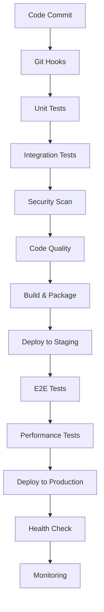

# دليل التحسين والتطوير - Laravel Production System

## نظرة عامة
هذا الدليل يغطي استراتيجيات التحسين المستمر، إعداد CI/CD pipelines، والتحسينات المتقدمة لضمان تطوير ونشر فعال ونظيف.

---

## 1. إعداد CI/CD Pipeline

### 1.1 هيكل CI/CD العام



### 1.2 إعداد GitHub Actions

#### إنشاء `.github/workflows/deploy.yml`:
```yaml
name: Laravel CI/CD Pipeline

on:
  push:
    branches: [ main, develop ]
  pull_request:
    branches: [ main, develop ]

env:
  PHP_VERSION: '8.2'
  MYSQL_VERSION: '8.0'
  NODE_VERSION: '18'

jobs:
  # Code Quality and Security
  code-quality:
    runs-on: ubuntu-latest
    
    services:
      mysql:
        image: mysql:8.0
        env:
          MYSQL_ROOT_PASSWORD: password
          MYSQL_DATABASE: laravel_test
        ports:
          - 3306/tcp
        options: --health-cmd="mysqladmin ping" --health-interval=10s --health-timeout=5s --health-retries=3

    steps:
    - name: Checkout code
      uses: actions/checkout@v4

    - name: Setup PHP
      uses: shivammathur/setup-php@v2
      with:
        php-version: ${{ env.PHP_VERSION }}
        extensions: mbstring, xml, ctype, json, fileinfo, intl, pdo_mysql, bcmath, gd, redis
        tools: composer:v2
        coverage: xdebug

    - name: Setup Node.js
      uses: actions/setup-node@v4
      with:
        node-version: ${{ env.NODE_VERSION }}
        cache: 'npm'

    - name: Cache Composer packages
      id: composer-cache
      uses: actions/cache@v3
      with:
        path: vendor
        key: ${{ runner.os }}-php-${{ hashFiles('**/composer.lock') }}
        restore-keys: |
          ${{ runner.os }}-php-

    - name: Install dependencies
      run: composer install --no-progress --prefer-dist --optimize-autoloader

    - name: Setup application
      run: |
        cp .env.example .env
        php artisan key:generate
      env:
        APP_ENV: testing
        APP_DEBUG: true
        APP_KEY: base64:9Qnm9GCHm+KLi+yFTHQdT5NwBtY8tKwWe9U3LqU3sPE=

    - name: Run migrations
      run: php artisan migrate --force
      env:
        DB_CONNECTION: mysql
        DB_HOST: 127.0.0.1
        DB_PORT: 3306
        DB_DATABASE: laravel_test
        DB_USERNAME: root
        DB_PASSWORD: password

    # Code Quality Checks
    - name: PHP CodeSniffer
      run: vendor/bin/phpcs --standard=PSR12 app/ --report-full

    - name: PHPStan Analysis
      run: vendor/bin/phpstan analyse --level=max app/ --memory-limit=2G

    # Security Checks
    - name: Security Audit
      run: composer audit

    - name: Enlightn Security Scan
      run: vendor/bin/enlightn scan

    # Unit and Feature Tests
    - name: Run Tests
      run: vendor/bin/phpunit --coverage-text --colors=never
      env:
        DB_CONNECTION: mysql
        DB_HOST: 127.0.0.1
        DB_PORT: 3306
        DB_DATABASE: laravel_test
        DB_USERNAME: root
        DB_PASSWORD: password
        APP_ENV: testing
        APP_DEBUG: true
```

### 1.3 Git Hooks Configuration

#### إنشاء `.husky/pre-commit`:
```bash
#!/usr/bin/env sh
. "$(dirname -- "$0")/_/husky.sh"

# Linting
echo "Running PHP CodeSniffer..."
npx lint-staged

# Unit tests
echo "Running unit tests..."
vendor/bin/phpunit --no-coverage --testdox

# Security check
echo "Running security audit..."
composer audit

# Build assets
echo "Building assets..."
npm run build
```

---

## 2. التحسين التلقائي للاختبارات

### 2.1 Test Automation Framework

#### إنشاء `tests/Automation/AutomatedTestSuite.php`:
```php
<?php

namespace Tests\Automation;

use Tests\TestCase;
use Illuminate\Foundation\Testing\TestConcerns\InteractsWithDatabase;
use Illuminate\Foundation\Testing\TestConcerns\InteractsWithQueue;
use Illuminate\Support\Facades\Queue;
use Illuminate\Support\Facades\Cache;

class AutomatedTestSuite extends TestCase
{
    use InteractsWithDatabase, InteractsWithQueue;

    protected $resetDatabase = true;
    protected $resetCache = true;
    protected $resetQueues = true;

    protected function setUp(): void
    {
        parent::setUp();
        $this->beforeApplicationDestroyedCallbacks[] = function () {
            $this->cleanup();
        };
    }

    protected function cleanup()
    {
        if ($this->resetDatabase) {
            $this->artisan('migrate:fresh --seed');
        }

        if ($this->resetCache) {
            Cache::flush();
        }

        if ($this->resetQueues) {
            Queue::testMode()->assertNothingPushed();
        }
    }

    /** @test */
    public function full_workflow_test()
    {
        $this->withoutMiddleware(ThrottlingMiddleware::class);
        
        $user = $this->createUser();
        $customer = $this->createCustomer();
        $order = $this->createOrder($user, $customer);

        // Test API endpoints
        $this->actingAs($user)
            ->getJson('/api/orders/' . $order->id)
            ->assertStatus(200)
            ->assertJsonStructure([
                'id',
                'customer_id',
                'total',
                'status',
                'items' => [
                    [
                        'id',
                        'product_id',
                        'quantity',
                        'price'
                    ]
                ]
            ]);

        // Test business logic
        $this->assertEquals('pending', $order->fresh()->status);
        
        $order->update(['status' => 'confirmed']);
        $this->assertEquals('confirmed', $order->fresh()->status);

        // Test queue jobs
        Queue::fake();
        $order->process();
        Queue::assertPushed(OrderProcessingJob::class, 1);
    }
}
```

### 2.2 Automated Performance Testing

#### إنشاء `tests/Performance/LoadTest.php`:
```php
<?php

namespace Tests\Performance;

use Tests\TestCase;
use Illuminate\Support\Facades\Http;
use Illuminate\Support\Facades\DB;

class LoadTest extends TestCase
{
    public function test_api_load_performance()
    {
        $startTime = microtime(true);
        $requests = [];
        
        // Simulate 100 concurrent requests
        for ($i = 0; $i < 100; $i++) {
            $requests[] = $this->makeApiCall('/api/orders', [
                'customer_id' => $i + 1,
                'items' => [
                    ['product_id' => 1, 'quantity' => 1, 'price' => 50.00]
                ]
            ]);
        }

        $endTime = microtime(true);
        $totalTime = $endTime - $startTime;
        $averageResponseTime = $totalTime / 100;

        // Assertions
        $this->assertLessThan(1.0, $averageResponseTime, 'Average response time should be less than 1 second');
        
        // No more than 10% should fail
        $failedRequests = array_filter($requests, fn($request) => $request['status'] >= 400);
        $failureRate = count($failedRequests) / 100;
        $this->assertLessThan(0.1, $failureRate, 'Failure rate should be less than 10%');
    }

    public function test_database_performance()
    {
        // Create test data
        $customers = \App\Models\Customer::factory()->count(1000)->create();
        $orders = \App\Models\Order::factory()->count(5000)->create();

        $startTime = microtime(true);
        
        // Test complex query performance
        $result = DB::table('orders')
            ->join('customers', 'orders.customer_id', '=', 'customers.id')
            ->join('order_items', 'orders.id', '=', 'order_items.order_id')
            ->where('orders.status', 'confirmed')
            ->where('orders.created_at', '>=', now()->subDays(30))
            ->select(
                'orders.id',
                'customers.name',
                DB::raw('SUM(order_items.quantity * order_items.price) as total_amount'),
                'orders.status'
            )
            ->groupBy('orders.id', 'customers.name', 'orders.status')
            ->get();

        $endTime = microtime(true);
        $queryTime = $endTime - $startTime;

        $this->assertLessThan(2.0, $queryTime, 'Complex query should complete in less than 2 seconds');
        $this->assertGreaterThan(0, $result->count(), 'Should return some results');
    }

    private function makeApiCall($endpoint, $data = [])
    {
        $startTime = microtime(true);
        $response = Http::post($endpoint, $data);
        $endTime = microtime(true);
        
        return [
            'status' => $response->status(),
            'response_time' => $endTime - $startTime,
            'data' => $response->json()
        ];
    }
}
```

---

## 3. تحسينات الأداء المتقدمة

### 3.1 Database Query Optimization

#### إنشاء `app/Services/QueryOptimizer.php`:
```php
<?php

namespace App\Services;

use Illuminate\Support\Facades\DB;
use Illuminate\Support\Facades\Log;

class QueryOptimizer
{
    public function analyzeSlowQueries()
    {
        $slowQueries = DB::select("
            SELECT 
                query_time,
                lock_time,
                rows_sent,
                rows_examined,
                sql_text
            FROM mysql.slow_log 
            WHERE start_time > DATE_SUB(NOW(), INTERVAL 24 HOUR)
            ORDER BY query_time DESC
            LIMIT 10
        ");

        foreach ($slowQueries as $query) {
            Log::info('Slow query detected', [
                'query_time' => $query->query_time,
                'lock_time' => $query->lock_time,
                'rows_examined' => $query->rows_examined,
                'sql' => $query->sql_text
            ]);
        }

        return $slowQueries;
    }

    public function optimizeTable($table)
    {
        DB::statement("OPTIMIZE TABLE `{$table}`");
        
        Log::info("Table optimized: {$table}");
    }
}
```

### 3.2 Cache Optimization

#### إنشاء `app/Services/CacheManager.php`:
```php
<?php

namespace App\Services;

use Illuminate\Support\Facades\Cache;
use Illuminate\Support\Facades\Redis;

class CacheManager
{
    private $defaultTtl = 3600; // 1 hour

    public function warmup()
    {
        // Warm up frequently accessed data
        $this->warmupUsers();
        $this->warmupCategories();
        $this->warmupDashboard();
    }

    private function warmupUsers()
    {
        $users = \App\Models\User::select('id', 'name', 'email', 'status')
            ->where('status', 'active')
            ->orderBy('name')
            ->limit(1000)
            ->get();

        Cache::put('users_active_list', $users, 3600);
        
        Log::info('Cache warmed: users_active_list', ['count' => $users->count()]);
    }

    public function getCacheStats()
    {
        $stats = [
            'hit_rate' => $this->calculateHitRate(),
            'memory_usage' => $this->getMemoryUsage(),
            'key_count' => $this->getKeyCount(),
        ];

        return $stats;
    }

    private function calculateHitRate()
    {
        $info = Redis::info('stats');
        $hits = $info['keyspace_hits'] ?? 0;
        $misses = $info['keyspace_misses'] ?? 0;
        $total = $hits + $misses;
        
        return $total > 0 ? round(($hits / $total) * 100, 2) : 0;
    }

    private function getMemoryUsage()
    {
        $info = Redis::info('memory');
        return $info['used_memory_human'] ?? 'N/A';
    }

    private function getKeyCount()
    {
        return Redis::dbSize();
    }
}
```

---

## 4. تطوير الميزات الجديدة

### 4.1 Feature Development Workflow

#### إنشاء Feature Branch Template
```bash
#!/bin/bash
# create-feature.sh

FEATURE_NAME=$1
if [ -z "$FEATURE_NAME" ]; then
    echo "Usage: ./create-feature.sh <feature-name>"
    exit 1
fi

# Format feature name
FEATURE_BRANCH="feature/$FEATURE_NAME"

# Get current branch
CURRENT_BRANCH=$(git branch --show-current)

# Switch to develop
git checkout develop
git pull origin develop

# Create feature branch
git checkout -b $FEATURE_BRANCH

# Set up tracking
git push -u origin $FEATURE_BRANCH

echo "Feature branch '$FEATURE_BRANCH' created and set up."
```

### 4.2 Code Templates

#### Creating Reusable Service Template
```php
<?php

namespace App\Services;

use Illuminate\Support\Facades\Log;
use Illuminate\Support\Facades\Cache;
use Illuminate\Support\Facades\DB;
use Illuminate\Support\Facades\Queue;

abstract class BaseService
{
    protected $model;
    protected $cacheEnabled = true;
    protected $cacheTtl = 3600; // 1 hour
    protected $transactionEnabled = true;

    /**
     * Get cached data or fresh data
     */
    protected function getCached($key, $callback)
    {
        if (!$this->cacheEnabled) {
            return $callback();
        }

        return Cache::remember($key, $this->cacheTtl, $callback);
    }

    /**
     * Execute callback in database transaction
     */
    protected function executeInTransaction($callback)
    {
        if (!$this->transactionEnabled) {
            return $callback();
        }

        return DB::transaction($callback);
    }

    /**
     * Log activity
     */
    protected function logActivity($action, $data = [])
    {
        Log::info("Service activity: {$action}", array_merge([
            'service' => static::class,
            'timestamp' => now(),
        ], $data));
    }
}
```

### 4.3 Code Generation

#### Creating Custom Artisan Commands
```php
<?php

namespace App\Console\Commands;

use Illuminate\Console\Command;
use Illuminate\Support\Facades\File;

class MakeService extends Command
{
    protected $signature = 'make:service {name : The service class name}';
    protected $description = 'Create a new service class';

    public function handle()
    {
        $name = $this->argument('name');
        $path = app_path("Services/{$name}.php");
        
        if (File::exists($path)) {
            $this->error("Service {$name} already exists!");
            return 1;
        }
        
        $content = $this->generateServiceContent($name);
        File::put($path, $content);
        
        $this->info("Service {$name} created successfully.");
        
        return 0;
    }

    private function generateServiceContent($name)
    {
        $content = "<?php\n\n";
        $content .= "namespace App\\Services;\n\n";
        $content .= "use Illuminate\\Support\\Facades\\Log;\n";
        $content .= "use Illuminate\\Support\\Facades\\Cache;\n\n";
        $content .= "class {$name} extends BaseService\n";
        $content .= "{\n";
        $content .= "    /**\n";
        $content .= "     * Get all records\n";
        $content .= "     */\n";
        $content .= "    public function getAll(\$perPage = 15)\n";
        $content .= "    {\n";
        $content .= "        \$this->logActivity('getAll');\n";
        $content .= "        \n";
        $content .= "        return \$this->getCached('all_records', function() use (\$perPage) {\n";
        $content .= "            // Return paginated results\n";
        $content .= "            return \\App\\Models\\Model::paginate(\$perPage);\n";
        $content .= "        });\n";
        $content .= "    }\n";
        $content .= "}\n";
        
        return $content;
    }
}
```

---

## 5. عملية Rollback

### 5.1 Rollback Strategy

#### إنشاء `scripts/rollback.sh`:
```bash
#!/bin/bash

# Laravel Production Rollback Script
# Usage: ./rollback.sh [deployment_id | version_tag]

set -euo pipefail

DEPLOYMENT_ID=${1:-"latest"}
APP_PATH="/var/www/your-app"
BACKUP_DIR="/var/backups/deployments"
LOG_FILE="/var/log/rollback-$(date +%Y%m%d_%H%M%S).log"

# Colors
RED='\033[0;31m'
GREEN='\033[0;32m'
YELLOW='\033[1;33m'
NC='\033[0m'

log() {
    echo -e "${GREEN}[$(date +'%Y-%m-%d %H:%M:%S')]${NC} $1" | tee -a "$LOG_FILE"
}

error() {
    echo -e "${RED}[ERROR]${NC} $1" | tee -a "$LOG_FILE"
    exit 1
}

# 1. Pre-rollback checks
pre_rollback_checks() {
    log "Starting pre-rollback checks..."
    
    # Check if user is root
    if [ "$EUID" -ne 0 ]; then
        error "This script must be run as root"
    fi
    
    # Check if backup exists
    if [ "$DEPLOYMENT_ID" = "latest" ]; then
        BACKUP_FILE=$(find "$BACKUP_DIR" -name "deployment-*-*.tar.gz" -type f -printf '%T@ %p\n' | sort -n | tail -1 | cut -d' ' -f2-)
    else
        BACKUP_FILE="$BACKUP_DIR/deployment-$DEPLOYMENT_ID.tar.gz"
    fi
    
    if [ ! -f "$BACKUP_FILE" ]; then
        error "Backup file not found: $BACKUP_FILE"
    fi
    
    log "Found backup: $BACKUP_FILE"
}

# 2. Stop services
stop_services() {
    log "Stopping services..."
    systemctl stop nginx
    systemctl stop php8.2-fpm
    log "✓ Services stopped"
}

# 3. Rollback application
rollback_application() {
    log "Rolling back application..."
    
    # Remove current application
    rm -rf "$APP_PATH"
    mkdir -p "$APP_PATH"
    
    # Extract backup
    tar -xzf "$BACKUP_FILE" -C "$APP_PATH"
    
    # Set proper permissions
    chown -R www-data:www-data "$APP_PATH"
    chmod -R 755 "$APP_PATH"
    chmod -R 775 "$APP_PATH/storage"
    chmod -R 775 "$APP_PATH/bootstrap/cache"
    
    log "✓ Application rolled back"
}

# 4. Start services
start_services() {
    log "Starting services..."
    systemctl start php8.2-fpm
    systemctl start nginx
    log "✓ Services started"
}

# 5. Health check after rollback
health_check_after() {
    log "Performing health check after rollback..."
    
    # Wait for services to be ready
    sleep 30
    
    # Check application
    if curl -f -s http://localhost/health > /dev/null; then
        log "✓ Application health check passed"
    else
        error "Application health check failed after rollback"
    fi
}

# Main execution
main() {
    log "Starting rollback process for deployment: $DEPLOYMENT_ID"
    
    pre_rollback_checks
    stop_services
    rollback_application
    start_services
    health_check_after
    
    log "Rollback process completed successfully!"
}

# Ask for confirmation
echo "⚠️  This will roll back the application to a previous state."
echo "⚠️  This action cannot be undone."
read -p "Are you sure you want to continue? (yes/no): " confirm

if [ "$confirm" != "yes" ]; then
    echo "Rollback cancelled."
    exit 0
fi

# Run main function
main "$@"
```

---

## الخلاصة

هذا الدليل يضمن:
- CI/CD pipeline متكامل وآمن
- تحسينات أداء مستمرة
- عمليات تطوير منظمة ومرنة
- آليات rollback فعالة وموثوقة
- مراقبة وتحكم تلقائي في النظام

الهدف هو بناء نظام تطوير نظيف ومستقر وقابل للتوسع مع ضمان الجودة والأمان.